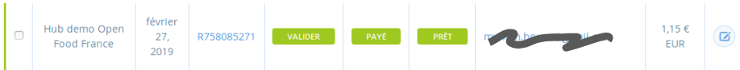
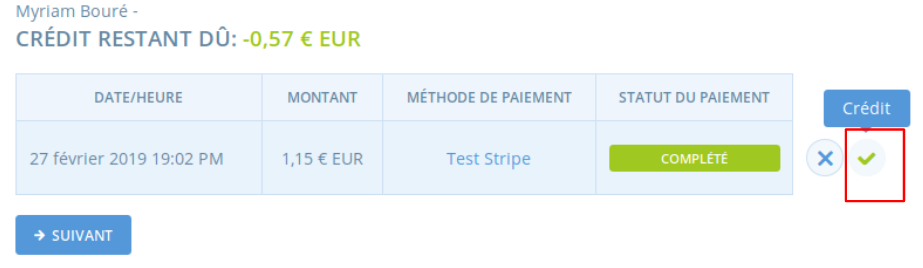
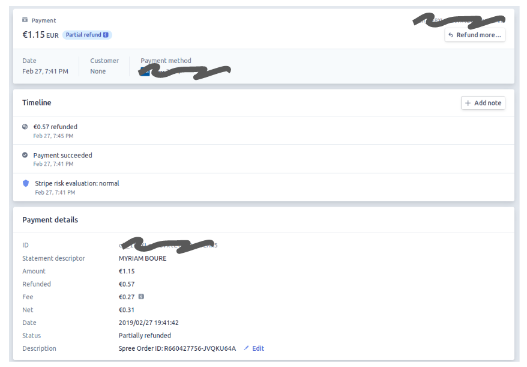

# Ajustements de paiement

Sur certaines commandes, vous allez être amené à procéder à des ajustements, de type :  
-  un **produit avec un poids variable** a été commandé, et au moment de la livraison, vous allez rentrer le poids exact pour que le prix réellement à payer s'ajuste  
- un produit qui était commandé **n'a pas été livré** par le producteur  
- l'acheteur a souhaité sur place **acheter un peu plus que prévu** dans la commande d'origine  
- il y a un soucis sur la commande et vous voulez **accorder une ristourne sur cette commande**  
- etc.

Deux cas de figure principaux se présentent :  
  
**1- La commande n'a pas été payée d'avance** et sera réglée sur place au moment du retrait. Dans ce cas, les ajustements sont passés avant le règlement, et ce qui sera réglé sera donc le montant final exact.

**2- La commande a été payée au moment de la commande, par Stripe ou Paypal par exemple, ou virement bancaire.** Dans ce cas, 3 situations possibles :  
- le solde est créditeur, vous devez de l'argent à l'acheteur et souhaitez le rembourser  
- le solde est créditeur, vous devez de l'argent à l'acheteur et souhaitez qu'il puisse utiliser ce solde pour payer en partie sa prochaine facture  
- le solde est débiteur, il vous doit de l'argent

## A- Comment rembourser un trop perçu sur une commande ?

### a- Paiement via Stripe

Si le paiement a été effectué via votre compte marchand Stripe, le remboursement peut être géré directement via Open Food France.

La commande que vous souhaitez ajuster est notée comme "payée" :

Vous allez vouloir soit saisir l'ajustement en édition de cette commande, soit modifier le poids du produit réel dans "gestion des commandes par lot, par exemple". Ici nous prenons le cas d'une modification de poids livré réellement à un acheteur :

 Vous constatez ensuite la commande modifiée avec le crédit sur la commande, et vous pouvez alors cliquer sur le symbole "Créditer" ici encadré sur l'image pour lancer le remboursement par Stripe sur le compte du client du crédit dû :

Vous constatez bien sur votre compte Stripe le remboursement partiel :


Le remboursement va mettre 5 à 10 jours pour apparaître sur le compte de votre acheteur.



Les frais prélevés par Stripe \(1,2 - 1,4% + 0,2 cts par transaction\) ne sont pas remboursés bien entendu, et reste prélevés sur la base du montant payé à l'origine. Il peut être parfois plus avantageux de capturer un ajustement sur la commande suivante de l'acheteur, ou lui proposer d'utiliser ses crédits pour payer une future commande \(fonctionnalité qui sera développée dans les mois à venir\).


Si une commande a été annulée et que vous voulez intégralement rembourser la commande, vous également pouvez le faire directement depuis l'interface Open Food France :

### b- Paiement via Paypal

Les remboursements partiels ou totaux de commandes réglés par Paypal ne fonctionne pas bien pour le moment sur Open Food France. Pour l'instant aucun organisateur de circuit court n'utilise cette méthod de paiement, Stripe étant bien plus économique. Si vous souhaitez néanmoins utiliser Paypal, contactez-nous pour que nous puissions prioriser la gestion des remboursements par Paypal dans notre feuille de route.

### c- Paiement via virement bancaire

Si le paiement a été réalisé via un mode de paiement non automatique \(hors Stripe et Paypal donc\), mais déjà capturé comme payé, comme par exemple, via virement bancaire, vous pouvez saisir un ajustement sur la commande, et capturer un paiement négatif \[à vérifier quand le [bug](https://github.com/openfoodfoundation/openfoodnetwork/issues/3562) sera résolu\].

## B- Comment permettre à  un acheteur de régler partiellement sa prochaine facture avec ses crédits ?

Il vous est aussi possible de ne pas rembourser une commande, mais simplement de déduire le montant dû de la prochaine commande via un ajustement manuel sur cette prochaine commande.


Nous avons le projet de permettre à un acheteur qui a des crédits disponible de les utiliser en priorité pour régler sa prochaine commande. Cette fonctionnalité n'a pas encore été développée mais [a été priorisée dans notre feuille de route](https://community.openfoodnetwork.org/t/enable-customers-to-pay-partially-or-fully-with-their-credits/1211). Si cette fonctionnalité répond aussi à votre besoin, n'hésitez pas à nous contacter pour que nous prenions en compte votre situation dans le design de la fonctionnalité.


## C- Comment prélever le montant complémentaire ?

Si vous avez ajouté à une commande déjà réglée \(quel que soit le moyen de paiement\) un nouvel article par exemple, vous avez la possibilité de capturer un paiement complémentaire. Ce paiement doit être capturé manuellement, et ne peut pas être prélevé via Stripe ou Paypal. 


Tant que les prélèvements complémentaires sur des paiement en ligne via Stripe ou Paypal ne peuvent pas être gérés de manière satisfaisante, il peut être judicieux d'être vigilant à la façon de saisir les produits, pour éviter les ajustements positifs, et inviter à passer une commande complémentaire si un produit a été oublié, cette nouvelle commande pouvant donc être réglée via Stripe ou Paypal.


  

