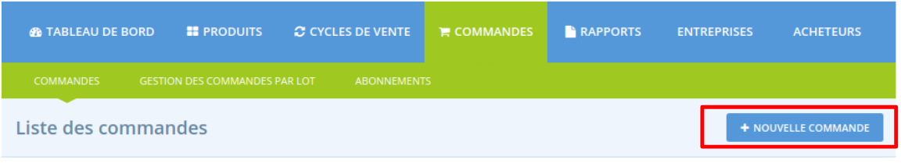

# Création de commande

Parfois, vous souhaitez passer vous même une commande manuellement dans le système, pour le compte d'un acheteur ou pour que vos rapports incluent une commande issue d'une autre plateforme par exemple. Rendez-vous sur **Commandes** et cliquez sur le bouton **Nouvelle Commande** :

Suivez ensuite pas à pas le processus :

Sélectionnez le distributeur sur lequel doit être enregistré la commande puis le cycle de vente. En fonction du cycle de vente choisi, les produits pouvant être ajoutés à la commande ainsi que les marges ne seront pas forcément les mêmes, selon le paramétrage du cycle de vente. 

Vous serez redirigé sur la page suivante où vous pourrez ajouter les produits \(vous devez commencez à taper les premières lettres pour que des suggestions apparaissent\) :

Indiquez les quantités. Une fois tous les produits ajoutés, cliquez sur **mettre à jour et recalculer les frais.**

L'étape suivante est d'ajouter les informations liées à l'acheteur dans le menu vertical "détails client". Si l'acheteur fait déjà parti de vos clients, vous pouvez le sélectionner via la liste déroulante, ou alors remplir les champs et indiquer une commande invité :

Cliquez sur **Ajustements** ou directement sur **Paiements** \(à droite de l'écran\) avant de continuer et sélectionner une méthode de livraison :

Ensuite vous pouvez réaliser des ajustements comme l'ajout d'une commission. Continuez.

La dernière étape est le choix de la méthode de paiement :

Cliquez sur **mettre à jour** et envoyez un email de confirmation à l'acheteur.

