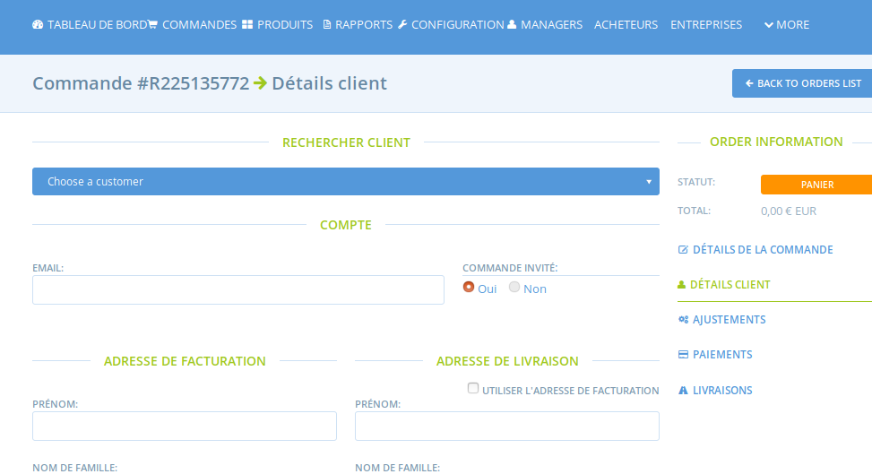

# Création de commandes

Parfois, vous souhaitez insérer vous même une commande manuellement dans le système, pour le compte d'un acheteur ou pour que vos rapports incluent une commande issue d'une autre plateforme par exemple. Rendez-vous sur **Commandes** et cliquez sur le bouton **Nouvelle Commande** :

Sélectionnez le hub sur lequel doit être enregistré la commande puis le cycle de vente. En fonction du cycle de vente choisi, les produits pouvant être ajoutés à la commande ainsi que les marges ne seront pas forcément les mêmes \(tout dépend de vos paramètres pour ces deux fonctionnalités\). 

Vous serez redirigé sur la page suivante où vous pourrez ajouter les produits en les recharchant en tapant leur premières lettres :

Indiquez les quantités. Une fois tous les produits ajoutés, cliquez sur **update and recalculate fees.**

L'étape suivante est d'ajouter les informations liées à l'acheteur dans le menu vertical "détails client". Si l'acheteur fait déjà parti de vos clients, vous pouvez le sélectionner via la liste déroulante, ou alors remplir les champs et indiquer une commande invité :

Cliquez sur continuer et sélectionnez une méthode de livraison :

Ensuite vous pouvez réaliser des ajustements comme l'ajout d'une commission. Continuez.

LA dernière étape est le choix de la méthode de paiement :

Cliquez sur **mettre à jour** et envoyez un email de confirmation à l'acheteur.

