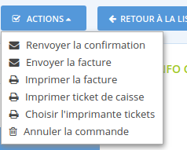

# Impression de tickets de caisse


Cette fonctionnalité n'est pour l'instant disponible que sur l'instance française d'Open Food Network \(CoopCircuits\). Contactez le fournisseur local de la plateforme Open Food Network pour plus d'informations, ou pour demander l'accès à cette fonctionnalité.


## Quelle imprimante ?

Pour imprimer un ticket de caisse, vous avez besoin d'une imprimante spécifique dite "imprimante thermique", capable de parler le langage de contrôle ESC/P \(la plupart des imprimantes thermiques parlent ce langage\). 

Par exemple :  
-  Epson one \(utilisée communément par les commerçants\)\). Disponible sur Amazon pour environ 150€  
- Une imprimante thermique premier prix coute entre 15€ et 50€ sur internet. 

## Paramétrage du système

Comment paramétrer ma machine pour pouvoir imprimer un ticket de caisse depuis le site Open Food Network ?

Vous devez d'abord installer l'imprimante thermique en suivant les instructions correspondantes à votre système d'exploitation données par le fournisseur \(pour les imprimantes USB, vous n'aurez peut-être pas à préciser l'URI, mais assurez-vous d'avoir les drivers nécessaires\).

Ensuite, vous devez installer QZ Tray qui est un plug-in pour imprimante qui lancera automatiquement l'impression du ticket sans que vous n'ayez à sélectionner l'imprimante et cliquer sur "imprimer" à chaque fois que vous lancer une impression. Vous pouvez télécharger QZ Tray [depuis ce site](https://qz.io/download/#).

Lancer QZ Tray s'il ne se lance pas automatiquement, puis ouvrez la page "print\_ticket.html” dans votre navigateur. Les certificats ne fonctionneront pas mais vous pourrez imprimer une page test. 

## Imprimer un ticket

Rendez-vous dans le menu "Commandes" et cliquez sur le bouton vous permettant de modifier une commande. Ensuite sous le bouton "actions" vous trouverez l'action "imprimer le ticket de caisse". Cliquez dessus.

Une nouvelle fenêtre va s'ouvrir et vous pourrez sélectionner votre imprimante.

L'imprimante sélectionnée sera sauvegardée dans votre navigateur.  Si vous souhaitez modifier ce choix, au sein du même bouton actions vous trouverez toujours pas la suite le menu "Choisir l'imprimante tickets", afin de modifier votre choix d'imprimante.

