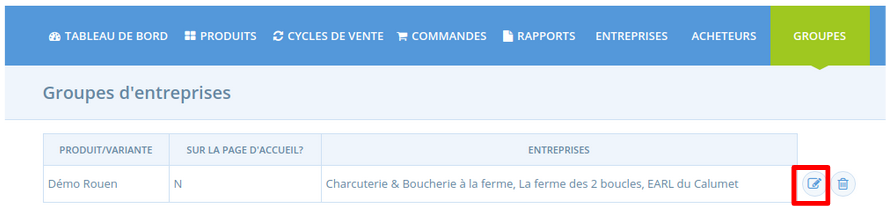
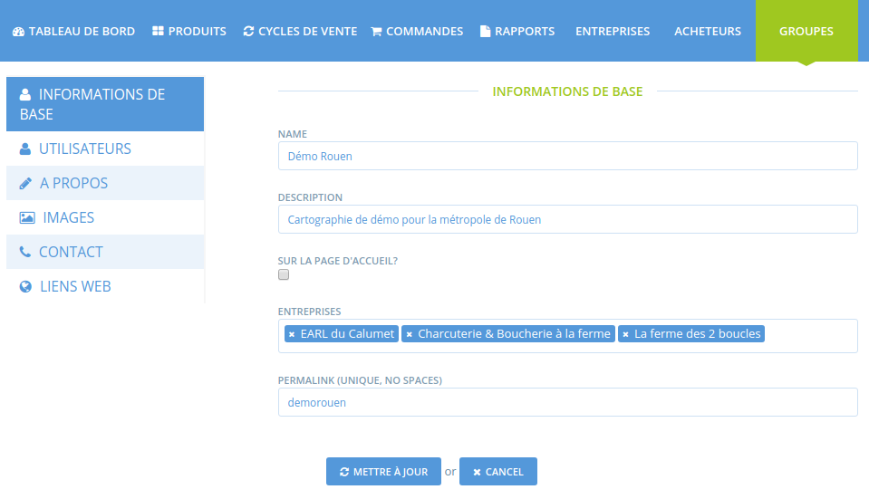

# Créer une page groupe

**Qu'est-ce que c'est ?** C'est une manière d'avoir un profil collectif, représenté via une cartographie spécifique rassemblant l'ensemble des membres de votre collectif, sur la plateforme locale Open Food Network. Un groupe peut être par exemple un réseau de producteurs sur un territoire, un réseau de producteurs certifiés, l'écosystème d'un hub complexe avec plusieurs distributeurs et de nombreux producteurs, etc.

**Cela ressemble à quoi ?** Vous pouvez voir les groupes existants en cliquant sur le menu "groupes" depuis la vue visiteur de votre plateforme Open Food Network.

**Comment créer une page groupe ?** Il est nécessaire de nous contacter pour la mise en place de votre groupe, cette fonctionnalité nécessite un paramétrage par une personne autorisée qui créera le groupe pour vous et vous nommera administrateur du groupe.

## Gérer une page groupe

Une fois administrateur du groupe, vous aurez accès au menu groupe. Vous visualisez alors les groupes pour lesquels vous êtes administrateur et pouvez aller modifier le paramétrage du groupe.

### Informations de base

**Nom :** Donnez un nom à votre groupe.

**Description :** Cette description sera visible sur la page de votre groupe.

**Sur la page d'accueil ?** **:** Cochez cette case pour que le groupe soit visible sur le site Open Food Network, dans le menu "groupes". Cette action peut être réalisée à tout moment.

**Entreprises :** Sélectionnez les entreprises que vous souhaitez faire figurer dans le groupe. ****Vous pouvez rechercher des entreprises dans toutes celles actuellement existantes sur la plateforme. Si vous avez déjà ajouté une entreprise à votre groupe, elle n'apparaîtra plus dans la recherche.

**Permalink \(unique, no space\) :** C'est l'élément qui s'affichera dans le lien url de la page de votre groupe, après le début d'url suivant : https://www.openfoodnetwork.be/groups/permalink

### Utilisateurs

**Gestionnaire principal :**  Cet utilisateur a les droits d'administration du groupe \(modification, ...\) Contactez-nous si vous souhaitez changer le gestionnaire.

### A propos

Cette partie vous permet de détailler la présentation de votre groupe \(la description dans les informations de base étant généralement courte, plutôt une phrase\).

### Images

**Logo :** Cette image doit être carrée. Elle sera affichée en en-tête de votre page groupe.

**Promo Image :** Cette image sera visible en haut de votre page groupe. Nous recommandons une taille de 1200 x 260 pixels.

### Contact

Vous avez la possibilité d'ajouter des coordonnées de contact pour votre groupe. Elles seront visibles.

### Liens web

Un site internet, une page Facebook... indiquez tout liens intéressants concernant votre groupe ici !

