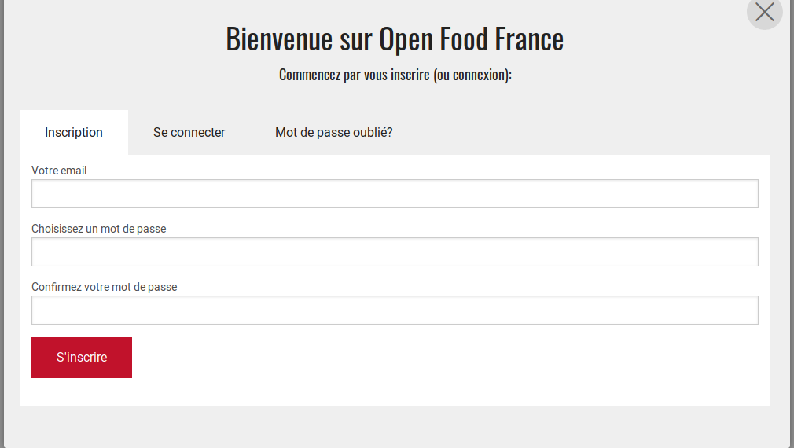

# Inscription et création de profil

1. Rendez-vous sur [https://www.openfoodfrance.org/register](https://www.openfoodfrance.org/register). Vous arrivez sur l'écran ci-dessous : 
2. Renseignez votre adresse email et choisissez un mot de passe
3. Vous recevrez ensuite un email avec un lien vous permettant de confirmer votre adresse email. Cliquez sur ce lien qui vous dirigera vers la page de connexion.
4. Connectez-vous. _Click the ‘Agree to Terms of Service’ box and click ‘Let’s Get Started!’_
5. Renseignez le nom de votre entreprise et vos coordonnées
6. Choose if you’re ‘a producer’ \(e.g. farmer, baker, etc\) or ‘not a producer’ \(We call non-producers hubs, which includes: a seller and/or distributor of food: coop, food hub, wholesaler etc.\).
7. Click the ‘create profile’ button. You'll receive a confirmation email when the profile is created. If you close the registration window now, you can continue to add information to your profile later.
8. Fill in your profile enterprise description, images, website/social media and business details.

**Votre profil est désormais créé, bravo !**

Pour vous connecter à l'interface d'administration, connectez-vous à la plateforme puis cliquez sur la petite roue dentée en haut à droite : 

Lors de votre première connexion à l'interface d'administration, on vous demandera de choisir vos types de packages. Pour en savoir plus, consultez [cette page](types-de-package.md).

