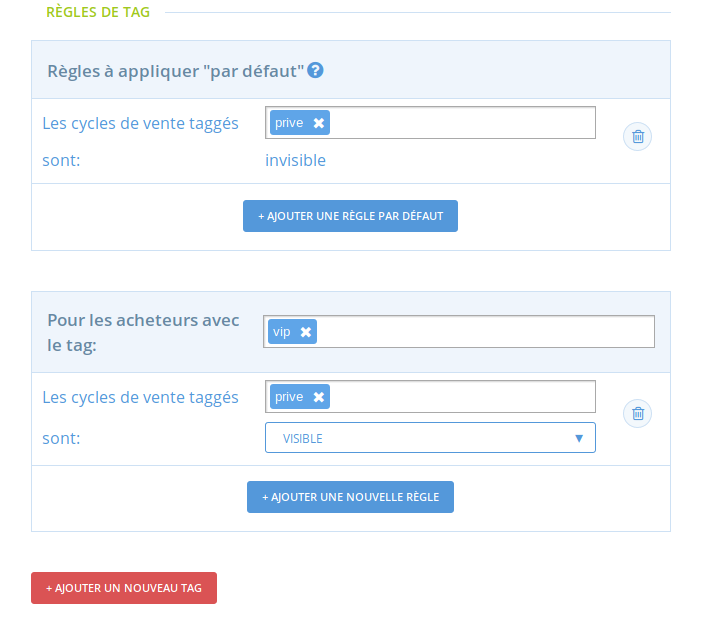
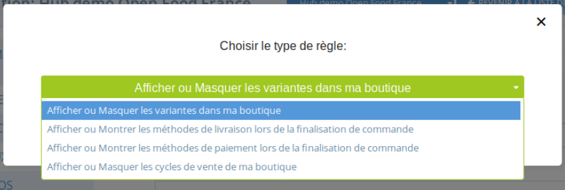
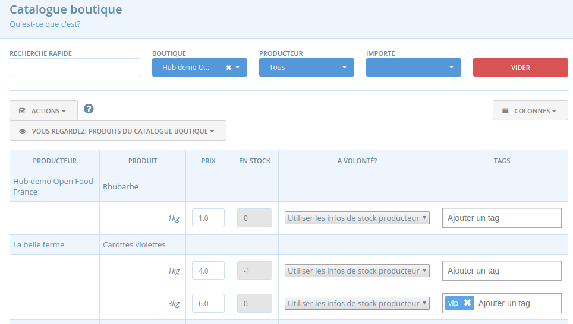
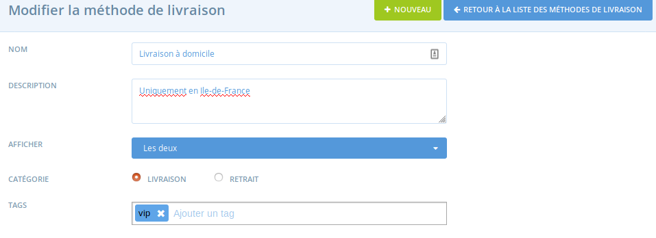
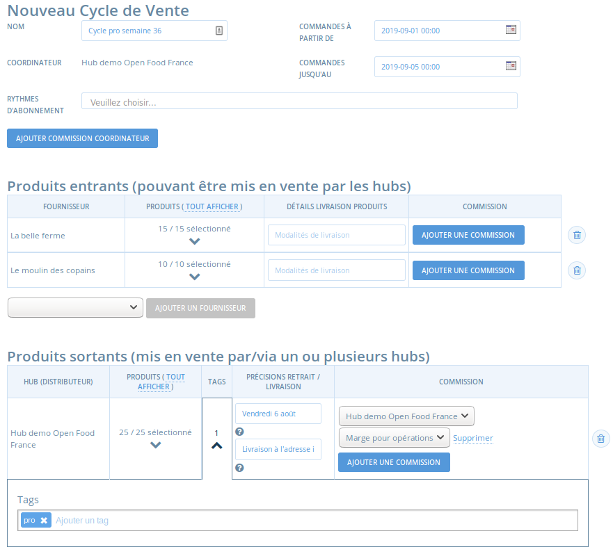

# Affichages et prix conditionnels selon la catégorie d'acheteurs \(tags\)

## Règles de tags

Une fois les acheteurs regroupés par catégories \(une fois qu'un tag leur a été associé, [voir page précédente](gestion-des-acheteurs-et-regroupement-par-categorie.md#tags-association-dun-acheteur-a-une-categorie-donnee)\), vous allez pouvoir définir les règles d'affichage suivantes : 

* Rendre certaines variantes visibles ou invisibles
* Rendre des méthodes de livraison visibles ou invisibles
* Rendre des méthodes de paiement visibles ou invisibles
* Rendre des cycles de vente visibles ou invisibles

Le plus souvent cette fonctionnalité sera utilisée par les entreprises ayant une segmentation de leurs acheteurs bien définie \(membres vs non-membres par exemple, ou professionnels vs particuliers\).

## Comment paramétrer une règle de tag

Allez sur le menu **Entreprises** &gt; **Paramètres** &gt; **Règles de tag**

### Les règles par défaut

Par défaut, tout est visible pour tout le monde, tagué ou pas. Vous pouvez modifier les règles d'affichage par défaut en cliquant sur "ajouter une règle par défaut". Par exemple, vous pouvez dire que par défaut, tous les cycles de ventes taggés "privés" sont invisibles \(et vous les rendrez ensuite visibles pour certaines catégories d'acheteurs uniquement, dans l'exemple ci-dessous, pour les acheteurs qui ont le tag "VIP"\).

### Les règles de tags

Une fois les règles par défaut définies, vous allez pouvoir paramétrer des exceptions à ces règles pour certaines catégories d'acheteurs.

* Vous devez d'abord définir pour quelle catégorie d'acheteur va se produire l'exception. Dans l'exemple ci-dessus, pour les acheteurs qui ont le tag "VIP".
* Vous allez ensuite définir, pour ces acheteurs, les exceptions qui s'appliquent, parmi les 4 choix possibles :


Lorsque vous paramétrer une règle, qu'il s'agisse d'une règle par défaut ou conditionnelle, selon la règle choisir, pensez bien à appliquer les tags concernés aux variantes / cycles de vente / méthodes de livraison / méthodes de paiement concernées !


Balayons chacune de ces options une par une.

#### Afficher ou masquer les variantes dans ma boutique

Cette règle permet de rendre une variante \(déclinaison d'un produit\) visible ou invisible dans la boutique pour certaines acheteurs. Pour cette règle, le tag sur la variante est à associer au niveau du [catalogue boutique](../../produits-1/inventory-tool.md) et pas dans le catalogue du producteur concerné. Dans l'exemple ci-dessous, la variante "carottes par 3kg" est taggée "vip", et on pourrait créé une règle disant que par défaut, les variantes taggées "vip" sont invisibles, et que pour les acheteurs taggés "vip" elles deviennent visibles.

#### Afficher ou masquer les méthodes de livraison lors de la finalisation de la commande

Cette règle permet de réserver certaines méthodes de livraison à certaines catégories d'acheteurs. Pour cette règle, il faudra donc associer un tag aux méthodes de livraison concernées. Dans l'exemple ci-dessous, la méthode de livraison "à domicile" est taggée "vip", et on pourrait créé une règle disant que par défaut les méthodes de livraison taggées "vip" sont invisibles, et que pour les acheteurs taggés "vip" elles deviennent visibles.

#### Afficher ou masquer les méthodes de paiement lors de la finalisation de la commande

Cette règle permet de réserver certaines méthodes de paiement à certaines catégories d'acheteurs, par exemple un paiement sur facture sera une option proposée uniquement aux acheteurs professionnels. Pour cette règle, il faudra donc associer un tag aux méthodes de paiement concernées. Dans l'exemple ci-dessous, la méthode de paiement "Paiement sur facture" est taggée "vip", et on pourrait créé une règle disant que par défaut les méthodes de paiement taggées "vip" sont invisibles, et que pour les acheteurs taggés "vip" elles deviennent visibles. 

#### Afficher ou masquer les cycles de vente de ma boutique

Cette règle permet de réserver l'accès à un cycle de vente de la boutique uniquement à certains acheteurs. Par exemple, un maraicher va créé un second cycle de vente pour les acheteurs professionnels, avec des marges différentes de celles appliquées aux particuliers, et souhaite que ce cycle de vente ne soit visible que pour les acheteurs pro bien sûr. Pour cette règle, il faudra donc associer un tag aux cycles de vente concernés. Dans l'exemple ci-dessous, le cycle de vente est taggé "pro". On pourrait créer une règle par défaut disant que les cycles de vente taggés "pro" sont invisibles, et ensuite les rendre visibles pour les acheteurs taggés "pro".


Cette règle de tag n'est possible que pour les boutique de type "hub", pas pour les boutique producteur simple \(producteur vendant uniquement ses produits\)


## Utiliser les tags pour gérer des tarifications différenciées selon la catégorie d'acheteur

Parfois, vous souhaitez appliquer des tarifications différentes selon le type d'acheteur : membre ou non-membre, particulier ou profesionnels, etc. 

Plusieurs possibilités de paramétrages utilisant les règles de tag sont à votre disposition  :

* Vous pouvez proposer une [méthode de livraison ](../types-de-livraisons.md)réservée aux membres \(exemple : "retrait au dépôt \(membres\)" vs "retrait au dépôt \(non membres\)", et associer des frais inférieurs, voir des frais négatifs \(correspondant donc à une ristourne\) pour la méthode concernant les membres. Quand le membre choisi cette méthode, le prix de sa commande est adapté \(le montant total diminue si des frais négatifs sont associés\). En revanche, cela implique de vérifier que l'acheteur ne triche pas lorsqu'il sélectionne la méthode correspondant à son profil, ou alors de taguer les membres "membres" et la méthode de paiement qui leur est réservée avec le même tag et paramétrer une règle de tag.
* Vous pouvez proposer une [méthode de paiement ](../methodes-de-paiements.md)avec des frais négatifs \(ce qui correspondra à une ristourne donc\) et réserver grâce aux tags cette méthode de paiement à des acheteurs professionnels par exemple. 
* Vous pouvez créer [deux cycles de vente](../cycles-de-vente/opening-more-than-one-order-cycle.md) : un cycle de vente pour les membres et un pour les non membres. Sur le cycle de vente dédié aux non-membres, vous pouvez appliquer une commission supérieure. Mais ici également, il faudra bien vérifier que les non-membres ont sélectionné le bon cycle de vente, ou cadrer les choses en utilisant les règles de tag et en taguant les acheteurs donc selon qu'ils sont membres ou non-membres.


Au delà de l'usage des tags, il est possible d'utiliser la fonctionnalité "catalogue boutique" pour gérer des tarifications différenciées. Vous pouvez par exemple créé une boutique pour les acheteurs pro, dont vous ne communiquer l'url qu'à ces acheteurs. Cette boutique peut gérer un catalogue boutique et modifier les prix des produits qui s'afficheront dans la boutique. Cette solution peut être utile lorsque la ristourne appliquée aux professionnels ne suit aucune "règle" fixe, et que les prix sont définis produits par produits.


#### 

