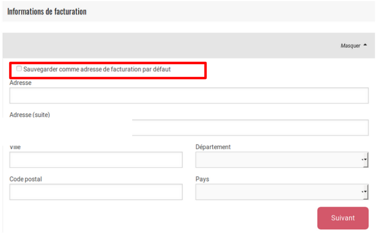

# Gestion des acheteurs et regroupement par catégorie

## Liste des acheteurs

Tous les acheteurs ayant passé une commande sur votre boutique se trouvent sur la page **Acheteurs** \(menu principal sur l'interface d'administration\).

Vous pouvez également ajouter manuellement un acheteur via le bouton "nouvel acheteur". Seul les acheteurs dans cette liste peuvent se voir attribuer un tag, donc être associés à une catégorie d'acheteur donnée.

## Adresse de facturation et de livraison par défaut

Chaque acheteur peut avoir une adresse de livraison et facturation par défaut. Ainsi le processus d'achat en ligne peut être plus rapide : en effet les champs vont se remplir automatiquement à partir du profil de l'acheteur \(il en va de même pour l'administrateur [s'il créer lui même la commande dans le système](../../commandes/manual-orders.md)\).

Si un acheteur change d'adresse, il peut aussi modifier cette adresse par défaut durant la commande en cochant la case "Sauvegarder comme adresse par défaut" :

## Tags \(association d'un acheteur à une catégorie donnée\)

Les acheteurs peuvent être associés à des catégories spécifiques, qui vont ensuite permettre des [affichages et prix conditionnels](customized-shopping-experience.md) par catégorie d'acheteur.

Vous pouvez créér une nouvelle catégorie d'acheteur en créant directement un nouveau tag, en l'associant à un acheteur donné. Pour ajouter un tag, il vous suffit de taper ce tag dans la colonne dédiée \(menu **Acheteurs**\). Un acheteur peut avoir plusieurs tags et bien évidemment un tag peut être lié à plusieurs acheteurs. Pour ce deuxième point, la seconde fois que vous taperez le tag dans la colonne correspondante, il vous sera suggéré via une liste déroulante. Faites bien attention à le sélectionner dans cette liste \(les tags sont sensibles à la casse donc à l'usage de majuscules / minuscules\).

Notez que les tags apparaissent également dans les [rapports](../../rapports.md). Vous pouvez donc les utilisez lors des exports csv/excel pour filtrer rapidement les données.

