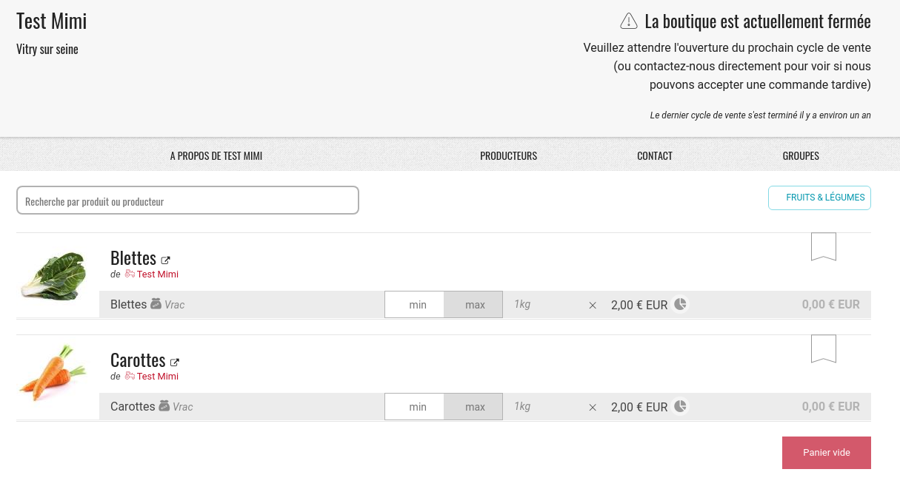

# Boutique vitrine sans possibilité d’achat

Il arrive qu'un gestionnaire de boutique souhaite afficher les produits qu'il vend sur une logique de "vitrine", pour faire savoir ce qu'il propose à la vente, mais sans vendre à proprement parler. Par exemple, pour montrer les produits qui seront bientôt en vente dans le prochain cycle de vente.

Pour paramétrer votre boutique en mode "vitrine sans achat possible", il faut ouvrir un [cycle de vente](cycles-de-vente/) incluant les produits que vous souhaitez afficher, et pour la période souhaitée. Puis allez dans **Entreprises &gt; Gérer &gt; Méthode de paiements** et désactiver toutes les méthodes de paiement en décochant la case "active?" comme dans l'image ci-dessous.

Et le tour est joué ! Vos produits s'affichent sur votre boutique, mais la boutique est bien affichée comme fermée à la commande. Exemple ci-dessous :

**N'oubliez pas de réactiver vos méthodes de paiements à la réouverture de la boutique !**


Pour pouvoir  créé le cycle de vente, le distributeur doit avoir au moins une méthode de paiement active. Donc vous devez créé le cycle "vitrine" avant de désactiver la méthode de paiement, sans quoi vous ne pourrez pas créé le cycle vitrine.


