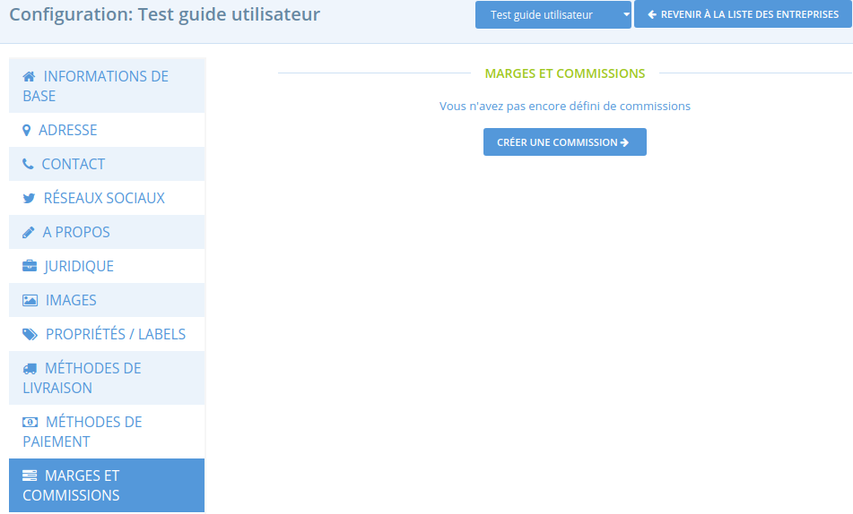

# Marges et commissions

Cette fonctionnalité est utile pour les producteurs et les hubs travaillant ensemble : cela permet d'allouer les coûts associés à l'administration, à la mise en panier, au transport et à la vente à chacune des parties. Par exemple, un hub va prendre une marge de 10% sur les produits qu'il distribue pour couvrir ses propres frais de vente, comme la rémunération de la personne qui gère les cycles de vente et les distribution.  
Pour les producteurs vendant leurs propres produits en direct, ces coûts sont déjà présents dans le prix du produit, ainsi appliquer des marges ou des commissions ne semble pas nécessaire. 

Lorsqu'une marge est appliquée, le consommateur est capable de voir la constitution du prix d'un produit sur la boutique en cliquant sur le camembert à droite du prix. Exemple ci-dessous :

## Définir une marge ou commission

**1\) Allez sur la page marges et commissions**

En tant qu'administrateur, allez sur le menu bleu **Entreprises** puis cliquez sur **paramètres** et enfin sur **marges et commissions** dans le menu vertical de gauche :

**2\)** Cliquez sur "**Créer une commission**". Vous êtes redirigez vers la page suivante :

**Entreprise :** Dans la première colonne, sélectionnez l'entreprise qui collectera la marge.

**Type de marge** **:** Sélectionnez le service lié à la marge \(transport, administration...\)

**Nom :** Choisissez un nom pour la marge.

**TVA applicable :** Sélectionnez la TVA applicable. Pour une marge imputée sur un produit, souvent la TVA est héritée du produit. Mais selon le modèle de commercialisation la marge pourra être soumise à une autre TVA, par exemple 20% si elle représente la contrepartie d'un service d'apport d'affaire. Si aucune TVA n'est appliquée, indiquez "TVA 0%".

**Calculateur :** La marge peut être calculée de différentes manières. Sélectionnez le [calculateur](frais-et-taxes.md#le-calculateur) qui s'applique le mieux.

Pour finaliser, cliquez sur "Mettre à jour". Une fois que la marge a été créée, vous pouvez indiquer les montants nécessaires au calcul de la marge dans la colonne "Montant pour calculs".

## Le calculateur

**Pourcentage net** – Cette marge/commission correspond à un pourcentage pris sur le montant total de la commande.

**Poids \(au kg\)** – Cette marge/commission correspond à un montant fixe par kg commandé. Elle _s'applique uniquement à la somme des produits vendus par kg_. Elle ne s'appliquera donc pas aux produits vendus à la pièce par exemple.

**Montant fixe par commande** – La marge/commission correspond à un montant fixe pris pour l'ensemble de la commande, quelle que soit sa taille ou le nombre d'articles commandés.

**Montant variable selon nb article** – La marge/commission correspond à un montant donné par commande, mais qui varie selon le nombre d'articles commandés. Il peut s'agir par exemple d'une remise promotionnelle pour des achats en grosses quantités, "si l'acheteur commande plus de X articles les frais de gestion passent de Y à Z euros".

* ‘Coût du premier produit’ : Le montant de commission pris au premier article commandé
* ‘Coût des produits suivants’ : Le montant de commission pris pour les articles suivants
* 'Produits max’ : Le nombre maximum d'articles dans le panier sur lesquels la commission va s'appliquer. Aucune commission ne sera prise sur les articles suivants.

Exemple :  Si la marge du premier est de 2€, celle de l'objet supplémentaire 1 € et le nombre maximum d'objet est de 3. Si un client en commande 5, il paiera 2 € pour le premier, 1€ pour le second et aucune commissions pour les objets 3 et 4.

**Montant fixe par article** – Cette commission est un montant fixe qui s'applique pour chaque article commandé, mais uniquement aux articles vendus à la pièce \(et non ceux vendus au poids/volume\).

**Montant variable selon total commande** – Cette marge/commission est utilisée pour appliquer une marge réduite à partir du moment où la commande atteint un certain montant.

* ‘Montant minimal’ : Si la commande est en-dessous de ce montant, l'acheteur devra payer le ‘Montant normal'.
* ‘Montant de la réduction’ : Si la commande est égale ou supérieure au montant minimal, le consommateur devra payer le ‘Montant de la réduction’.
* 'Devise' : La monnaie utilisée \(généralement "EUR"\).

