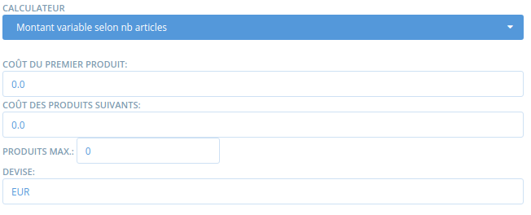

# Méthodes de paiement

La définition d'au moins une méthode de paiement est obligatoire avant l'ouverture d'une boutique !

## Définir une méthode de paiement

**1\) Allez sur la page méthodes de paiement**

En tant qu'administrateur, allez sur le menu bleu **Entreprises** puis cliquez sur **paramètres** et enfin sur **méthodes de paiement** dans le menu vertical de gauche :

**2\)** Cliquez sur "**En créer une maintenant**". 

**3\)** Sélectionnez votre entreprise dans la liste des hubs dans l'encart à droite. Cela signifie que la méthode de paiement sera créée pour cette entreprise. **Vous pouvez sélectionner plusieurs entreprises**.

**4\)** **Nom :** Choisissez un nom pour cette méthode de paiement. \(par exemple : "Payez par carte de crédit via Paypal"\). Ce nom s'affichera au moment du paiement pour l'acheteur, ainsi que dans les emails de confirmation qui lui seront envoyés.

**5\) Description :** ajoutez les détails associés la méthode de paiement. Par exemple, pour un virement, vous pouvez indiquez les détails du RIB. Cette description s'affichera au moment du paiement pour l'acheteur, ainsi que dans les emails de confirmation qui lui seront envoyés.

Un exemple de message au moment du choix de la méthode de paiement :

 **6\) Active :** Indiquez si vous souhaitez que cette méthode soit visible et utilisable.

**7\) Tags :** Utilisez les tags si vous souhaitez rendre certaines méthodes de paiements accessibles ou non pour certains types d'acheteurs \(voir le détail de la fonctionnalité [ici](affichages-et-prix-differencies-par-categorie-dacheteur/)\).

**8\)** **Fournisseurs** : Sélectionnez celui qui concerne la méthode que vous êtes en train de créer. Vous pouvez accepter les paiements de 5 "fournisseurs" de systèmes de paiement :

* Espèces / chèques / virements / autres \(il s'agit de liquide ou chèque ou virement bancaires ou tout autre option ne nécessitant pas de passer par un portail de paiement en ligne et n'impliquant pas de validation automatique\)
* PayPal Express
* Stripe

**9\) Calculateur :** Sélectionnez comment les frais éventuels associés à la méthode de paiement vont s'appliquer sur la commande. Notez que ces frais peuvent être équivalent à zéro. Voir ci-dessous les [options du calculateur](methodes-de-paiements.md#commissions-sur-les-methodes-de-paiements).

En cliquant sur **Créer**, la méthode de paiement sera créée et vous aurez de nouveaux champs pour définir les frais associés au calculateur choisi. Ces champs dépendent de la sélection effectuée dans le calculateur. Ainsi, si par la suite vous changez la sélection de calculateur, il faut d'abord sauvegarder votre modification \(mettre à jour\) et ensuite les champs associés apparaissent. 

## Les portails de paiement intégrés

### PayPal Express

Pour permettre un paiement par Paypal, vous devez avoir créé au préalable un compte Paypal professionnel. Vous pouvez en créer un [ici](https://www.paypal.com/fr/home). Ensuite il est nécessaire de paramétrer l'API. C'est elle qui vous permettra de connecter votre compte Paypal à votre boutique en ligne.

1. Connectez-vous à votre compte Paypal
2. Rendez-vous sur account settings:

3. Cliquez sur "mettre à jour" l'accès API:

4. Sélectionnez "Manage API credentials":

De là vous pouvez accéder au username de l'API, le mot de passe et la signature :

5. Sur Open Food Network, assurez-vous d'être connecté en tant que manager de l'entreprise concernée. Allez dans l'interface d'administration, puis dans le menu **Entreprises** et créez un méthode de paiement \(voir ci-dessus\). Sélectionnez Paypal et intégrer les informations :

**Les champs suivants sont à renseigner, les autres peuvent rester vides :**

**Server :** Indiquez " live "sans les guillemets à la place de "sandbox".

**Se connecter** **:** Indiquez le nom de l'API "API Username".

**Mot de passe :** Indiquez le mot de passe de l'API  "API Password".

**Signature :** Indiquez le contenu du champ Signature.

**Solution :** Ce champ détermine si les utilisateurs devront avoir un compte paypal pour payer ou non. Laissez "Mark" si l'utilisateur doit avoir un compte paypal, indiquez "Sole" si vous souhaitez le contraire.

**Page d'accueil :** vous pouvez sélectionner la page d'accueil une fois les utilisateurs redirigés vers paypal pour leur achat. Si vous avez sélectionné "Mark" avant, il vaut mieux indiquer "Login". Si non, "Billing" les renverra directement vers un écran leur permettant d'indiquer leur numéro de carte bleue.

### Stripe

[Stripe ](https://stripe.com/au)est une plateforme de paiement en ligne similaire à PayPal. Cette plateforme acceptera les paiements par carte bleue également. Contrairement à Paypal, l'acheteur final n'a pas besoin de compte. 

Si vous souhaitez utiliser la fonctionnalité d'[abonnement](../subscriptions/), Stripe est la seule méthode de paiement en ligne utilisable \(en dehors de méthode de paiement ne passant pas par un portail en ligne bien sûr\).

**Connecter avec Stripe**

Avant d'utiliser Stripe, il faut connecter votre compte marchand Stripe à votre entreprise sur Open Food Network. Cliquez sur ce bouton \(menu Entreprises &gt; Gérer &gt; Méthodes de paiements\) :

Vous serez redirigé vers un formulaire : soit vous avez déjà un compte Stripe et il suffit de vous connecter, soit vous devrez vous créer un compte. Les informations demandées incluent votre pays, votre activité, votre numéro SIREN, de TVA, votre adresse...

**Créer une nouvelle méthode de paiement**

Une fois connecté avec Stripe, créer votre méthode de paiement comme indiqué ci-dessus. Sélectionnez Stripe dans la liste des fournisseurs

**Stripe Account Owner :** sélectionnez l'entreprise avec laquelle vous avez créé le compte Stripe ou réalisé la connexion.

Si vous sélectionnez une entreprise qui n'a pas de compte Stripe connecté, vous aurez le message d'erreur ci-dessous. Le cas échéant, cliquez sur "en connecter un", ou répétez les opérations ci-dessus à partir du bouton "connecter avec stripe"

#### Le paiement via Stripe pour les acheteurs

Quand les acheteurs paient en ligne via Stripe, il peuvent cocher une case pour que leur carte de crédit soit enregistrée pour leurs prochains paiements \(seulement s'ils sont connecté à la plateforme Open Food Network\). Dans leur profil, ils peuvent également ajouter une carte ou en supprimer une \(Profil &gt; Compte\).

## Frais associés aux méthodes de paiements

Vous pouvez associer une commission à une méthode de paiement. Généralement cette fonctionnalité est utilisée pour répercuter les frais des portails de paiement sur l'acheteur. 

_Remarque : les commissions sur les méthodes de paiement n'incluent pas les taxes \(TVA\)._

### Le calculateur

**Pourcentage net** – Cette commission correspond à un pourcentage pris sur le montant total de la commande.

**Montant fixe par commande** – La commission correspond à un montant fixe pris pour l'ensemble de la commande, quelle que soit sa taille ou le nombre d'articles commandés.

**Montant variable selon nb article** – La marge/commission correspond à un montant donné par commande, mais qui varie selon le nombre d'articles commandés. Il peut s'agir par exemple d'une remise promotionnelle pour des achats en grosses quantités, "si l'acheteur commande plus de X articles les frais de gestion passent de Y à Z euros".

* ‘Coût du premier produit’ : Le montant de commission pris au premier article commandé
* ‘Coût des produits suivants’ : Le montant de commission pris pour les articles suivants
* 'Produits max’ : Le nombre maximum d'articles dans le panier sur lesquels la commission va s'appliquer. Aucune commission ne sera prise sur les articles suivants.

Exemple :  Si la marge du premier est de 2€, celle de l'objet supplémentaire 1 € et le nombre maximum d'objet est de 3. Si un client en commande 5, il paiera 2 € pour le premier, 1€ pour le second et aucune commission pour les objets 3 et 4.

**Montant fixe par article** – Cette commission est un montant fixe qui s'applique pour chaque article commandé, mais uniquement aux articles vendus à la pièce \(et non ceux vendus au poids/volume\).

**Montant variable selon total commande** – Cette marge/commission est utilisée pour appliquer une marge réduite à partir du moment où la commande atteint un certain montant.

* ‘Montant minimal’ : Si la commande est en-dessous de ce montant, l'acheteur devra payer le ‘Montant normal'.
* ‘Montant de la réduction’ : Si la commande est égale ou supérieure au montant minimal, le consommateur devra payer le ‘Montant de la réduction’.
* 'Devise' : La monnaie utilisée \(généralement "EUR"\).

## Gestion des remboursements

Selon la méthode de paiement choisie, la gestion des remboursements ne sera pas la même. [Consultez la page dédiée à ce sujet](../commandes/ajustements-de-paiement.md).

