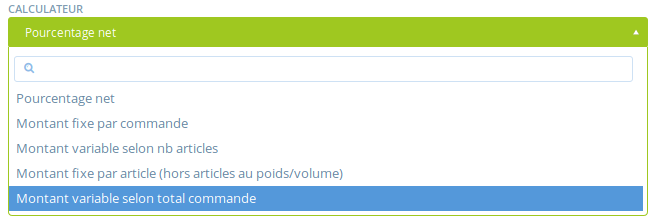

# Méthodes de livraison

La définition des méthodes de livraison est obligatoire avant l'ouverture d'une boutique !

## Définir une méthode de livraison

**1\)** **Allez sur la page méthode de livraison**

En tant qu'administrateur, allez sur le menu bleu **Entreprises** puis cliquez sur **gérer** et enfin sur **méthode de livraison** dans le menu vertical de gauche :

**2\)** Cliquez sur **créer une nouvelle méthode de livraison.** Vous serez redirigé sur cette page :

**3\)** Cochez la case correspondant à votre entreprise dans l'encart à droite intitulé "Hubs". Cela permettra à la méthode de bien s'appliquer à votre entreprise.

**4\) Nom :** Choisissez un nom pour la méthode. Ce nom sera affiché au client durant son processus d'achat et sur les emails de confirmation de commande. Exemple :

**5\) Description :** Ici vous pouvez ajouter des détails supplémentaires. Ces détails seront visibles pour les clients en gris à côté du nom \(cf. capture ci-dessus\).

**6\) Zone :** Sélectionnez la zone appropriée \(généralement EU\_VAT\).

**7\) Categorie :** Est-ce une livraison ou un retrait ?

**8\) Calculateur :** Sélectionnez comment les frais de livraisons vont s'appliquer sur la boutique. Notez que ces frais peuvent être équivalent à zéro.

En cliquant sur **Créer**, la méthode de livraison sera créée et vous aurez de nouveaux champs pour définir les frais de livraison. Ces champs dépendent de la sélection effectuée dans le calculateur. Ainsi, si par la suite vous changer la sélection de calculateur, il faut d'abord sauvegarder vos modification \(mettre à jour\) et ensuite les champs associés apparaissent. Pour la définition de ces champs, continuez la lecture de cette page.

### Le calculateur

**Pourcentage net** – Cette marge/commission correspond à un pourcentage pris sur le montant total de la commande.

**Montant fixe par commande** – La commission correspond à un montant fixe pris pour l'ensemble de la commande, quelle que soit sa taille ou le nombre d'articles commandés.

**Montant variable selon nb article** – La commission correspond à un montant donné par commande, mais qui varie selon le nombre d'articles commandés. Il peut s'agir par exemple d'une remise promotionnelle pour des achats en grosses quantités, "si l'acheteur commande plus de X articles les frais de gestion passent de Y à Z euros".

* ‘Coût du premier item’ : Le montant de commission pris au premier article commandé
* ‘Coût d'item additionnel’ : Le montant de commission pris pour les articles suivants
* ‘Nombre maximum d'objets’ : Le nombre maximum d'articles dans le panier sur lesquel la commission va s'appliquer. Aucune commission ne sera prise sur les articles suivants.

Exemple : Si la commission prise pour le premier article est de 2€, celle de l'article supplémentaire 1 € et le nombre maximum d'article est de 3. Si un client en commande 5, il paiera 2 € pour le premier, 1€ pour le 2ème et 3ème et aucune commission pour les articles 4 et 5.

**Montant fixe par article \(hors articles au poids/volume\)** – Cette commission est constante et s'applique pour chaque article commandé, mais uniquement aux articles vendus à la pièce \(et non ceux vendus au poids\).

**Montant variable selon total commande** – Cette marge est utilisée pour appliquer une marge réduite à partir du moment où la commande atteint un certain montant.

* ‘Montant minimal’ : Si la commande est en-dessous de ce montant, l'acheteur devra payer le ‘Montant normal'.
* ‘Montant de la réduction’ : Si la commande est égale ou supérieure au montant minimal, le consommateur devra payer le ‘Montant de la réduction’.
* 'Currency' : La monnaie utilisée \(généralement "EUR"\).

