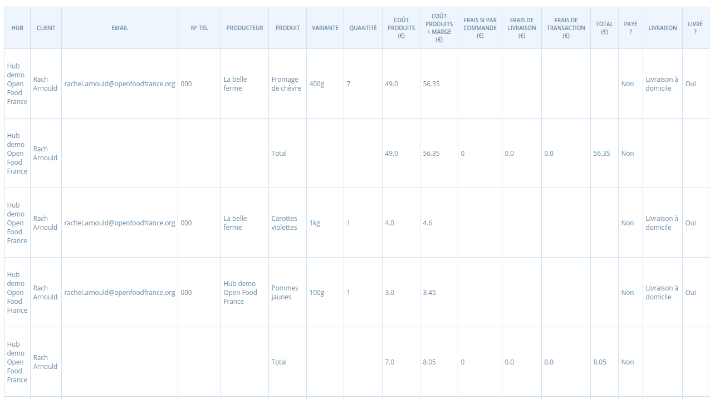
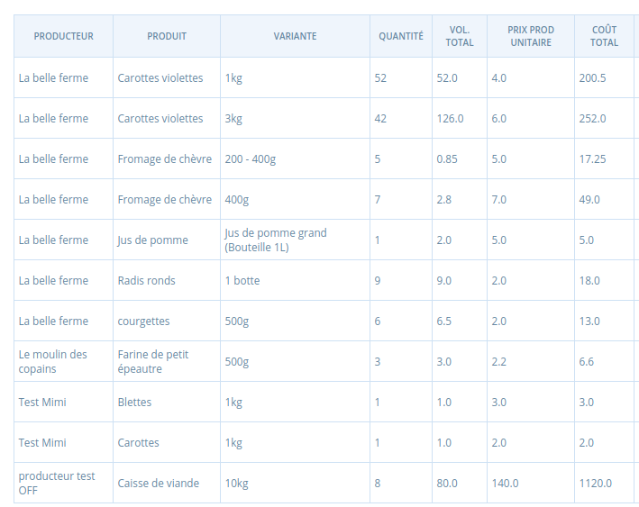
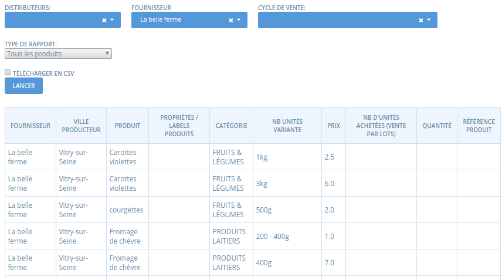
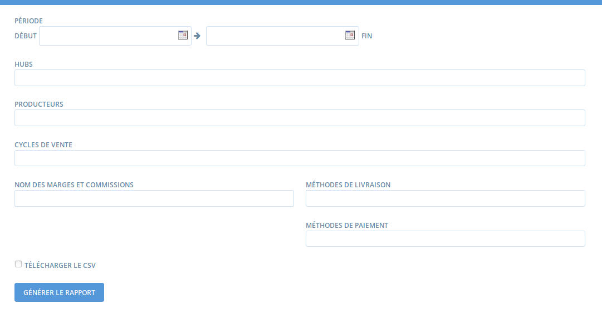
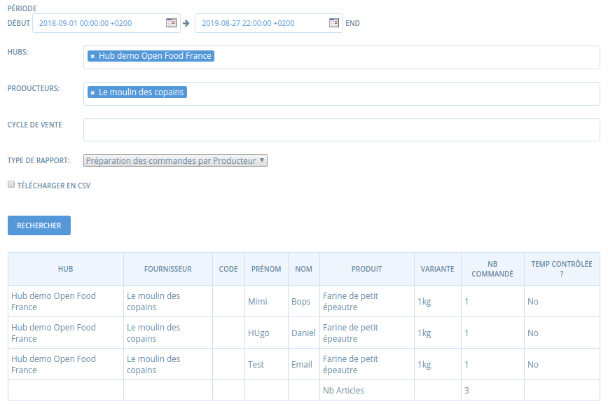
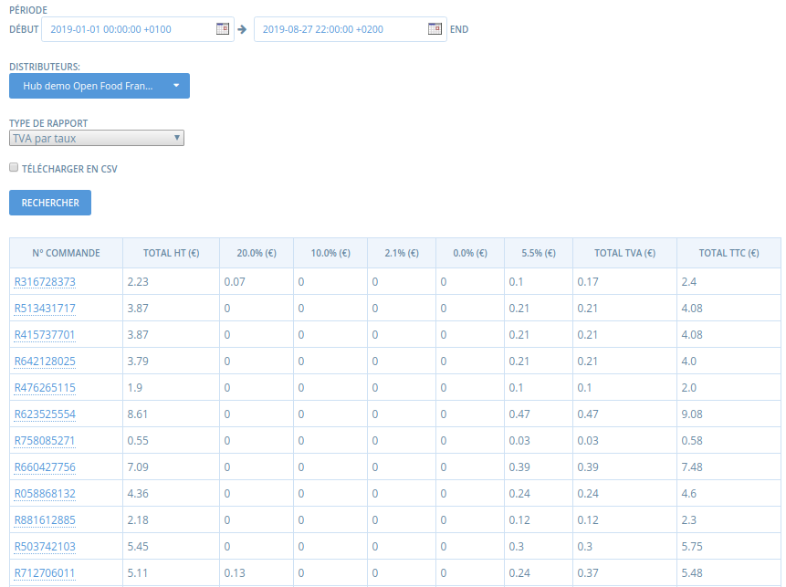
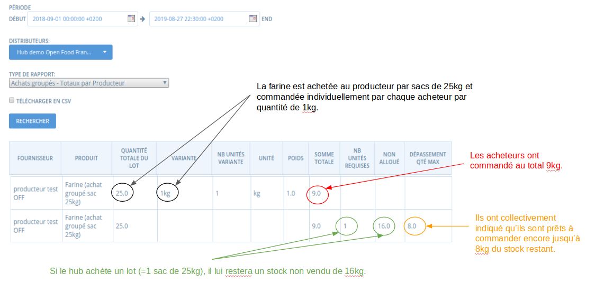

# Rapports \(export de données\)

Vous pouvez accéder à la page de génération de rapport via le menu **Rapports.** Ce qu'on appelle "rapport" est en réalité une liste prédéfinie d'exports de données.

Vous arrivez sur une page avec une liste de rapports prédéfinis.

Les deux rapports les plus utilisés sont les rapports **Totaux cycle de vente par producteur** et **Totaux cycle de vente par acheteur**. Si en tant que hub vous organisez l'approvisionnement des produits en gros par le producteur puis la mise en panier sur site, le premier rapport vous permettra de gérer vos commandes aux producteurs, le second la préparation des paniers individuels. La **Liste de mails** et les **Adresses** vous serons utiles pour gérer votre communication avec vos acheteurs. Le rapport de **TVA par taux de taxe** vous permettra de gérer vos déclarations de TVA. Les **Rapports des paiements** vous permettent de savoir ce qui a été payé et comment, et ce qui est dû sur chaque méthode de paiement choisie. Le rapport **Achats groupés en vrac** peut aider les décisions d'allocations afférentes aux [achats groupés par lot](produits-1/group-buy-for-bulk-ordering.md).

## **Totaux cycle de vente par acheteur**

L'image ci-dessous montre le coeur des informations obtenues via ce rapport \(non exhaustif, il y a d'autres colonnes ensuite avec les adresses, méthode de paiement choisie, etc.\). Ce rapport peut être filtré par cycle de vente pour un hub donné par exemple, ou selon un intervalle de dates, et peut être téléchargé au format CSV \(ce format s'ouvre via un tableau type Libre Office Calc ou Excel\) pour être manipulé à votre guise. Vous y retrouvez toutes les commandes \(produits, quantités et prix avec détail du prix producteur des produits, des marges et autres frais de livraison, etc.\) avec les emails et coordonnées des acheteurs. La méthode de livraison choisie est également indiquée.

Vous avez donc ici toutes les informations pour préparer des commandes individuelles une fois que vous avez tous les produits sources à portée de main ! Vous pouvez organiser votre mise en panier par point de livraison si vous filtrez par méthode de livraison choisie par exemple, ou packer par acheteur si vous remplissez caisse par caisse pour chaque acheteur, ou bien, si vous disposez tous les paniers et les remplissez produit par produit, vous pouvez filtrer par produit. Tout cela se fait aisément dans un tableur type Libre Office Calc ou Excel.

## Totaux de cycle de vente par producteur 

L'image ci-dessous montre les informations contenues dans ce rapport. Comme pour le rapport précédent, ce rapport peut être filtré par cycle de vente pour un hub donné par exemple, ou selon un intervalle de dates, et peut être téléchargé au format CSV \(ce format s'ouvre via un tableau type Libre Office Calc ou Excel\) pour être manipulé à votre guise. Le producteur est listé en entré dans la première colonne. Ensuite vous voyez pour chaque **produit** et **variante** de ce producteur le **nombre total d'unités commandées** selon les filtres définis. Ce rapport permet donc au hub de savoir les quantités de chaque produit source dont il a besoin pour satisfaire les commandes passées, et permet au producteur de savoir quoi préparer pour livrer le hub. 


Attention, la quantité ici correspond bien au nombre d'unités commandées du conditionnement de la variante. Il arrive fréquemment, par inatention, des erreurs de préparation de panier, par exemple si un producteur vend des courgettes par 500g et qu'il y a 4 unités de commandées, ce sont bien 2kg à préparer... parfois, l'habitude de penser "au kg" des producteurs qui vendent sur le marché entraîne des erreurs, ici par exemple, la préparation de 4kg au lieu de 2...


## Liste de mails / adresses 

Vous retrouverez ici les noms et adresses email des acheteurs ayant passé commande sur votre boutique, ou leurs adresses selon le rapport sélectionné. Vous pouvez filtrer par cycle de vente et télécharger au format CSV.

## Listings produits 

Les deux rapports "tous les produits" et "produits disponibles \(stock positif\)" présentent la liste des produits ainsi que leur prix. Le rapport "produits disponibles" ne présente que les produits pour lesquels vous disposez d'un stock positif. Si vous filtrez par producteurs les produits du producteur seront affichés. Si vous sélectionnez un distributeur tous les produits des catalogues pour lesquels le distributeur a la permission de vendre les produits seront affichés. Ces rapports peuvent servir par exemple à un producteur pour exporter la liste de ses produits afin de les réimporter dans un autre logiciel.

## Résumé des marges et commissions

Les entreprises peuvent paramétrer des [marges et commissions](mise-en-place-dune-boutique/frais-et-taxes.md) pour spécifier sur quels types de dépenses sont utilisées les marges et commissions collectées.  Cela permet au vendeur/distributeur de communiquer avec transparence sur les marges pour que l'acheteur comprenne ce qui revient au producteur et pourquoi le distributeur prend un marge. Ce rapport permet d'avoir une vision agrégée et détaillée des marges et commissions collectées.  Il contient des filtres par dates, hub, producteur et cycle de vente, type de marges et commissions à inclure dans le rapport \(selon leur nom\), méthode de livraison et méthode de paiement.

_Exemple 1:_ une boutique collecte sur chaque commande une marge de 2% de type "Levée de fonds" pour soutenir l'installation de nouveaux producteurs. Elle peut utiliser ce rapport pour connaître facilement le total collecté sur un cycle de vente particulier. 

_Exemple 2:_ un hub collecte des frais de transport sur les produits du producteur A et les reverse au producteur B qui passe récupérer les produits du producteur A et les amène au point de retrait du hub. Il peut utiliser ce rapport pour savoir combien il doit reverser au producteur B pour un cycle de vente donné ou une période donnée. 

_Exemple 3:_ un hub a paramétré une marge pour refléter de façon transparente à ses acheteurs le montant payé à la plateforme Open Food France. Il peut utiliser se rapport pour savoir combien il va devoir verser à Open Food France sur un cycle de vente ou une période donnée \(voir image ci-dessous, en Anglais pour le moment\).

## Préparation des commandes 

La plupart des hubs utilisent le rapport Totaux cycle de vente par acheteur et exporte les données pour les organiser selon le mode opératoire de leur mise en panier. Mais vous disposez également de deux autres rapports pour préparer la mise en panier.

**Préparation des commandes par acheteur**

Ce rapport liste tous les acheteurs ayant passé commande, avec les quantités commandées. Il est intéressant pour les hubs préparant les commandes utilisateurs par utilisateurs. Par contre, l'information sur la méthode de livraison choisie n'est pas indiquée.

**Préparation des commandes par producteur**

Ce rapport liste pour un distributeur donné tous les producteurs et leurs produits, et pour chaque produit, le nom des acheteurs qui ont commandé ce produit et la quantité commandée. Il est intéressant pour les hubs préparant les commandes par fournisseur / produit.

## TVA 

Le rapport le plus utilisé sera le rapport "TVA par taux de taxe" pour les déclarations à effectuées, souvent par taux de taxe. Mais vous pouvez aussi obtenir les informations de TVA par type de taxe \(ventes, livraison, marges, etc.\). Vous obtenez le détail pour chaque taux de taxe de chaque commande et pouvez aisément par un export CSV calculer le total à déclarer sur la période choisie.

## Achats groupés en vrac

Le rapport "achats groupés - totaux par producteur" indique au gestionnaire du hub si un ou plusieurs lots complets ont été atteints par la somme des commandes individuelles, et selon la réponse, combien il manque d'unités, ou de combien on a dépassé la limite, pour soutenir la décision du hub de commander ou pas le lot, voire plusieurs lots, et éventuellement gérer un peu de stock. Ce rapport n'est utile que pour les produits [paramétrés comme "vendus par lots"](produits-1/group-buy-for-bulk-ordering.md).

Quand le cycle de vente ferme, ce rapport peut vous aider à répondre aux questions suivantes : 

* Est-ce que les acheteurs ont commandé assez d'unités pour qu'on commande le lot au fournisseur ? 
* Combien d'unités en plus les acheteurs sont-ils prêts à commander pour atteindre la taille du lot ?
* Combien de lots le hub devrait il commander au fournisseur ?
* Si le hub commande un ou plusieurs lots, quel stock aura-t-il à gérer ? 

Ci-dessous figure une illustration de comment ce rapport peut être utilisé :

_NB : le rapport "allocation" offre des fonctions assez similaires, mais montre le détail de chaque commande individuelle au lieu de cumuler les nombres d'unités commandées._ 

