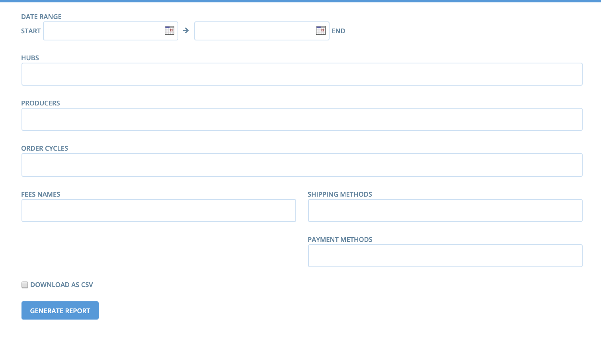

# Rapports \(export de données\)

Vous pouvez accéder à la page de génération de rapport via le menu **Rapports.** Ce qu'on appelle "rapport" est en réalisé une liste prédéfinie d'exports de données.

Vous arrivez sur une page avec une liste de rapports prédéfinis.

Les deux rapports les plus utilisés sont les rapports **Totaux cycle de vente par producteur** et **Totaux cycle de vente par acheteur**. Si en tant que hub vous organiser l'approvisionnement des produits en gros par le producteur puis la mise en panier sur site, le premier rapport vous permettra de gérer vos commandes, le second la préparation des paniers individuels. La **Liste de mails** et les **Adresses** vous serons utiles pour gérer votre communication avec vos acheteurs. Les rapports de **TVA** vous permettront de gérer vos déclarations de TVA. Les **Rapports des paiements** et **Rapport méthodes de paiement** vous permet de savoir ce qui a été payé et comment, et ce qui est dû sur chaque méthode de paiement choisie.

## **Totaux cycle de vente par acheteur**

Ce rapport peut être filtré par cycle de vente et téléchargé au format CSV \(ce format s'ouvre via un tableau type Libre Office Calc ou Excel\). Vous y retrouvez toutes les commandes \(produit, quantité et prix\) avec les emails et coordonnées des acheteurs. La méthode de livraison est également indiquée.

## Totaux de cycle de vente par producteur 

The picture below shows the information contained in an Order Cycle Supplier Totals report. Like the above report, this report can also be generated to reflect a particular order cycle by selecting an order cycle from the dropdown menu. As you can see, you may also select to download a CSV copy of this report \(an excel file\). In the report, the supplier is listed on the left. Next is listed all of the **products** and their **variants**, and the **amount** of each that sold. At the closing of an order cycle, this report clearly shows you how much of each product you will need on hand to successfully pack and fulfill all of the orders placed.

## Liste de mails 

Vous retrouverez ici les noms et adresses email des acheteurs ayant passé commande sur votre boutique. Vous pouvez filtrer par cycle de vente et télécharger au format CSV.

## Adresses 

Retrouvez dans ce rapport toutes les coordonnées de vos acheteurs.

## Produits et catalogue 

Ce rapport présente la liste des produits ainsi que leur prix. Attention la partie catalogue ne présente que les produits pour lesquels vous disposez d'un stock positif.

## Résumé des marges et commissions

Les entreprises peuvent paramétrer des [marges et commissions](mise-en-place-dune-boutique/frais-et-taxes.md) pour spécifier sur quels types de dépenses sont utilisées les marges et commissions collectées.  Cela permet au vendeur/distributer de communiquer avec transparence sur les marges pour que l'acheteur comprenne ce qui revient au producteur et pourquoi le distributeur prend un marge. Ce rapport permet d'avoir une vision agrégée et détaillée des marges et commissions collectées.  Il contient des filtres par dates, hub, producteur et cycle de vente, type de marges et commissions à inclure dans le rapport \(selon leur nom\), méthode de livraison et méthode de paiement.

Exemple 1: une boutique collecte sur chaque commande une marge de 2% de type "Levée de fonds" pour soutenir l'installation de nouveaux producteurs. Elle peut utiliser ce rapport pour connaître facilement le total collecté sur un cycle de vente particulier. 

Exemple 2: un hub collecte des frais de transport sur les produits du producteur A et les reverse au producteur B qui passe récupérer les produits du producteur A et les amène au point de retrait du hub. Il peut utiliser ce rapport pour savoir combien il doit reverser au producteur B pour un cycle de vente donné ou une période donnée. 

Exemple 3: un hub a paramétré une marge pour refléter de façon transparente à ses acheteurs le montant payé à la plateforme Open Food France. Il peut utiliser se rapport pour savoir combien il va devoir verser à Open Food France sur un cycle de vente ou une période donnée \(voir image ci-dessous, en Anglais pour le moment\).

## Préparation des commandes 

**Par Acheteur**

Ce rapport liste tous les acheteurs ayant passé commande, avec les quantités commandées. Il est intéressant pour les projets préparant les commandes utilisateurs par utilisateurs.

**Par producteur**

Ce rapport liste tous les producteurs avec les commandes et  quantités associées pour chaque acheteur. IL est intéressant pour les projets préparant les commandes par fournisseur.

## TVA 

Utilisez ce rapport pour faire ressortir les informations sur les montants de TVA.

