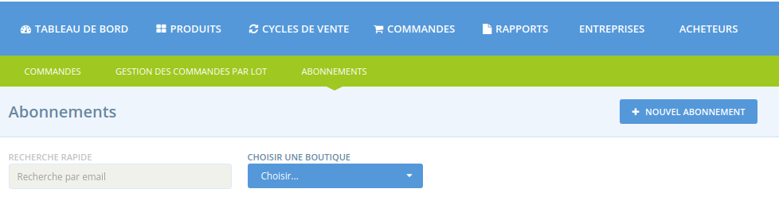
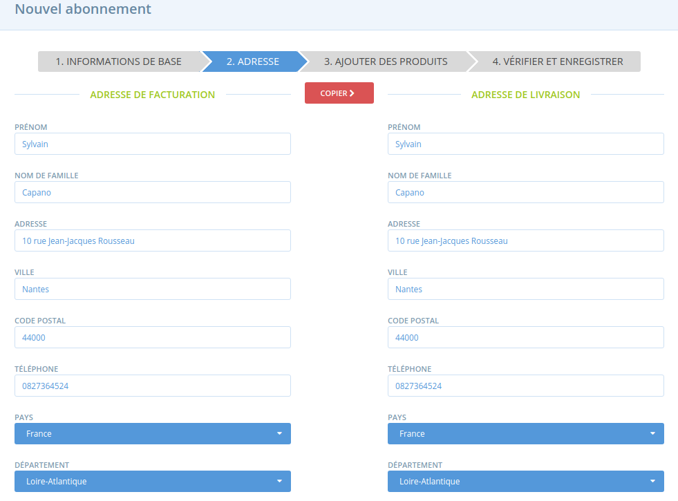

# Création et gestion d'une commande récurrente

Cette page explique comment mettre en place une commande récurrente pour un acheteur donné, incluant : la sélection des produits qui devront être automatiquement commandés pour l'acheteur, le rythme de ces commandes automatiques. Mais aussi, comment mettre en pause ou supprimer une commande récurrente.


Rappel : dans la première version du module, seuls les gestionnaires de boutiques en ligne peuvent mettre en place des commandes récurrentes, l'acheteur n'a pas la main directement dessus pour générer la mise en place de la commande récurrente.


**Rappel des choses à faire avant de passer aux étapes décrites ici :**

* [Activez les commandes récurrentes dans les paramètres de l'entreprise](configuration.md#1-enable-subscriptions)
* Vérifiez ou mettez en place les [méthodes de paiement et de livraison](configuration.md#2-make-sure-you-have-shipping-and-payment-methods-setup) pour l'entreprise​
* [Contactez vos acheteurs pour connaître leurs coordonnées et préférences \(option de paiement choisie, produits à commander et rythme de commande, ](configuration.md#3-gather-information-from-your-customers)etc.\) et leur rappeler [ce qu'ils doivent faire de leur côté \(création d'un compte utilisateurs, enregistrement d'une carte de crédit le cas échéant, etc.\)​](pour-lacheteur.md)
* [Ajoutez vos acheteurs à votre liste d'acheteurs](configuration.md#4-add-your-subscribers-to-your-customer-list)
* Créez au moins un [rythme d'abonnement​](configuration.md#create-a-schedule)

## 6\) Créer une commande récurrente 

Allez dans le menu général "Commandes" puis cliquez sur le sous-menu vert **Abonnements**.

Cliquez ensuite sur "Nouvel abonnement" :

**Acheteur :** Sélectionnez un acheteur dans la liste déroulante \(seuls les acheteurs présents dans votre liste d'acheteurs peuvent être sélectionnés\).

**Rythme d'abonnement :** Sélectionnez le rythme correspondant pour l'acheteur en question.

**Méthode de paiement :** pour rappel seuls Stripe et le paiement manuel \(espèce, chèque, virement bancaire\) peuvent être utilisés pour la mise en place de commandes récurrentes.

**Méthode de livraison :** Sélectionnez une méthode de livraison.

**Commence :** Il s'agit de la date de démarrage de la commande récurrente. 


Si cette date est postérieure à la date d'ouverture d'un cycle de vente en cours \(non encore terminée\) correspondant au rythme d'abonnement défini pour la commande récurrente, une commande sera automatiquement générée pour l'acheteur pour le cycle de vente en cours. Dans le cas contraire, la première commande automatique sera passée à l'ouverture du prochain cycle de vente correspondant au rythme d'abonnement choisi. 


**Termine :** Après cette date la commande récurrente ne sera plus générée. Ce champ peut être laissé vide et dans ce cas la commande se générera indéfiniment \(mais cela peut être modifié par la suite\).


Si la date de fin de la commande récurrente de l'acheteur se situe après la date de début d'un cycle de vente et avant la date de fin de celui-ci, il n'y aura pas de génération de commande sur ce cycle de vente. La dernière commande ne sera générée que pour le dernier cycle de vente qui ferme avant la fermeture de leur commande récurrente.


**Adresse :** Complétez les coordonnées de votre acheteur \(s'il était déjà connu de la plateforme, donc si l'acheteur a un compte et à déjà passé commande et rempli son adresse donc, les champs seront pré-remplis\).


Attention : si vous mettez à jour les coordonnées d'un acheteur depuis votre liste d'acheteurs, ces modifications ne seront pas répercutées sur les commandes récurrentes paramétrées. Vous devrez donc aussi préciser ces changements ici.


**Ajouter des produits :** Vous pouvez ajouter des produits proposé par le distributeur à condition que ces produits soient planifiés à la vente dans un cycle de vente à venir, et que ce cycle de vente corresponde au rythme d'abonnement choisi par l'acheteur. 


Vous ne pouvez pas ajouter un produit si ce dernier n'est pas proposé à la vente dans un cycle de vente futur correspondant au rythme d'abonnement de l'acheteur ! Un message d'erreur s'affichera le cas échéant.


#### Vérifier et enregistrer : relisez le tout et cliquez sur créer un abonnement ou annuler. 


Attention : si vous avez un cycle de vente en cours correspondant au rythme d'abonnement de la nouvelle commande récurrente saisie, dès la création de la commande récurrente, une commande va être générée et l'acheteur recevra un email de confirmation. Si vous ne souhaitez pas que la première commande automatique soit générée sur le cycle de vente en cours, assurez-vous de ne pas avoir de cycle de vente ouvert, ou mettez une date de début de commande récurrent postérieure à la fin du cycle de vente en cours.


**Que se passe-t-il si le prix d'un produit figurant dans une commande récurrente change ?** 

Les prix des produits dans les commandes récurrentes seront mis à jour selon les prix en vigeur dans le cycle de vente correspondant au déclenchement d'une nouvelle commande automatique. L'acheteur sera donc, à chaque nouvelle commande passée automatiquement en son nom, notifié de la commande passée pour lui et des prix appliqués. 

**Que se pass-t-il si un produit figurant dans une commande récurrente n'est pas disponible pour un cycle de vente donné ?** 

Dans ce cas, l'acheteur sera alerté de l'indisponibilité de certains produits dans sa confirmation de commande. 

## 7\) Modifier la commande récurrente d'un acheteur 

### Modifier tout l'abonnement 

Depuis la page **Subscriptions**, cliquez sur le bouton "modifier" à côté de la commande que vous souhaitez modifier.

A partir de là vous pouvez modifier les produits de son abonnement, la méthode de livraison ou de paiement, ainsi que les dates de début et de fin. 

**Vous ne pouvez pas modifier le rythme d'abonnement**. Pour cela vous devez recréer une commande récurrente avec un nouveau rythme et supprimer l'ancienne.

### Modifier une commande en particulier 

Dans la colonne "commandes", cliquez sur le numéro. Vous accéderez ainsi à la liste de toutes les commandes et vous pourrez en modifier une en particulier.

### Supprimer une commande récurrente 

Depuis la page **subscription**, cliquez sur la croix à côté de la commande récurrente. Cela supprimera définitivement la commande.

Si vous supprimez une commande alors qu'un cycle de vente est toujours ouvert, un message vous avertira afin de vous laisser l'option de garder la commande liée ou de la supprimer également.

### Mettre en pause une commande récurrente 

Depuis la page **subscription**, cliquez sur le bouton pause. Cela stoppera les commandes récurrentes jusqu'à ce que vous cliquiez sur le bouton play \(qui a remplacé le bouton pause une fois que vous avez cliqué dessus\).

Si vous mettez en pause une commande alors qu'un cycle de vente est toujours ouvert, un message vous avertira afin de vous laisser l'option de garder la commande liée ou de la mettre en pause également. Et inversement si vous relancez la commande récurrente alors qu'un cycle de vente est ouvert.

## 8\) Comment sont gérées les commandes récurrentes ? 

Une fois la mise en place effectuée, que se passe-t-il ?

**1\) Un cycle de vente compatible avec un rythme d'abonnement est ouvert :**

* Une commande est générée pour tous les acheteurs liés à ce rythme d'abonnement. Un email de confirmation de la commande leur est adressé.
* Le stock des produits commandés va diminuer.
* Un email résumant toutes les commandes passés ainsi que celle qui on eu des problèmes \(stock insuffisant\) est envoyé au responsable de la boutique en ligne.
* Les acheteurs peuvent modifier leur commande si vous leur en avez laissé la possibilité dans vos [paramètres de boutique](../votre-profil/parametres.md#preferences-boutique).

**2\) Un cycle de vente ferme**

* Les commandes seront confirmées
* Si l'acheteur paye par carte de crédit il sera débité
* L'acheteur reçoit un email de confirmation
* Le responsable de la boutique reçoit un email récapitulatif des commandes et des erreurs qui ont pu avoir lieu comme par exemple des carte de crédit qui n'ont pas pu être débitées

### Planifier les commandes récurrentes 

Il y a deux manières de planifier les commandes récurrentes. Quelle que soit celle choisie n'oubliez pas que la fréquence à laquelle vous ouvrez un nouveau cycle de vente avec commande récurrente correspondra à la fréquence à laquelle les commandes seront générées.

**De manière manuelle**

Vous pouvez créer des commandes par rythme d'abonnement une à une en ouvrant un cycle de vente à chaque besoin.

**De manière automatique**

Vous pouvez créer vos cycles de vente en avance et faire correspondre les dates à chaque date de commande. Vous pouvez utiliser la fonction de clonage d'un cycle de vente pour aller plus vite.

Pensez cependant à vérifier les stocks de vos produits régulièrement pour qu'il n'y ait pas de problème de disponibilité.

