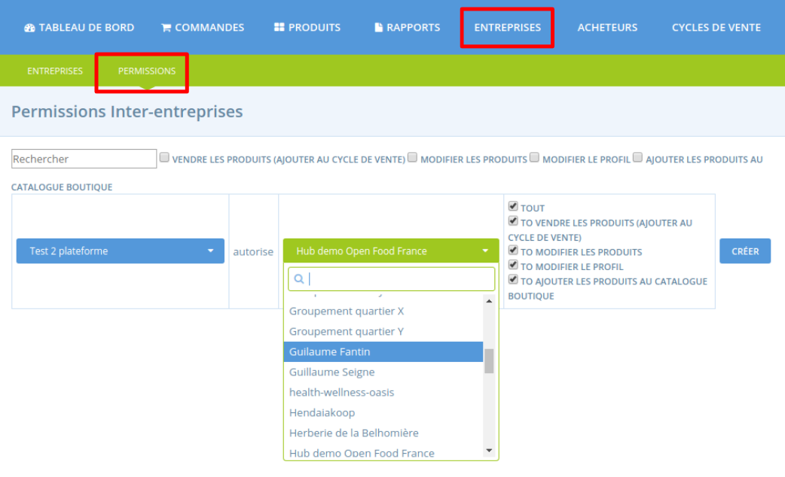

# Permissions inter-entreprises

Ces permissions doivent être octroyées pour qu'une entreprise deviennent fournisseur d'une autre ou inversement qu'une entreprise puisse distribuer les produits d'une autre. Un "droit" est accordé par une entreprise à une autre concernant l'accès / la modification des produits et du profil.

Cette page détaille les différentes permissions possibles et la manière de les allouer. Ensuite deux paragraphes vont plus loin en présentant les permissions depuis deux points de vue différents :

* [**Celui du hub**](e2e-permissions.md#E2Es-from-a-hubs-perspective)
* [**Celui du producteur**](e2e-permissions.md#E2Es-from-a-producers-perspective)

## Les différentes permissions

Il existe 4 différentes permissions. Elles peuvent se combiner de différentes manières afin de donner aux entreprises plus ou moins de droits suivant leurs profils. 

* **Permission de vendre les produits \(= ajouter au cycle de vente\) :** le fournisseur autorise le hub à ajouter ses produits à ses cycles de vente, donc à la vendre.
* **Permission d'ajouter les produits au catalogue boutique :** le fournisseur autorise le hub à ajouter ses produits au catalogue boutique du hub. Le hub pourra alors modifier les prix et stock des produits _uniquement pour sa boutique à lui_, cela n'affectera pas le catalogue du fournisseur.
* **Permission de modifier les produits :** le fournisseur autorise une entreprise \(hub ou producteur\) à créer, supprimer et modifier ses produits directement dans son catalogue fournisseur. Cela peut potentiellement impacter toutes les entreprises ayant accès au catalogue fournisseur car toute modification du catalogue du fournisseur se répercutera sur les distributions qui en sont faites.
* **Permission de modifier le profil :** une entreprise permet à une autre de modifier les détails de son profil \(coordonnées, adresse, description, ...\)

## Donner et gérer les permissions

Pour modifier, ajouter ou supprimer des permissions, rendez-vous sur l'interface d'administration puis dans le menu **Entreprises**, puis sous-menu **Permissions** \(voir capture ci-dessous\). Si vous avez besoin qu'une autre entreprise vous donne des permissions, vous devez les contacter par email ou téléphone. Il n'y a pas de fonctionnalité en ligne pour contacter une autre entreprise à ce sujet.


**Attention** : vous ne pouvez pas gérer les permissions de votre entreprise si vous n'êtes pas gestionnaire de l'entreprise.


Pour accorder une permission, dans la première colonne, sélectionnez votre entreprise et dans la seconde l'entreprise à qui vous donnez des droits. Cliquez ensuite sur le type de permissions que vous souhaitez accorder. Vous pouvez sélectionner plusieurs permissions ou les sélectionner toutes en cliquant sur "TOUT". Puis cliquez sur "Créer". Notez que vous pouvez supprimer ou modifier ces permissions à tout moment.

## Les permissions générées automatiquement

Lorsqu'un utilisateur est gestionnaire principal de plusieurs entreprises sur la plateforme, les 4v permissions sont créées automatiquement entre chaque entreprise. Ce n'est pas le cas entre des entreprises administrées par des utilisateurs différents.

## Point de vue d'un hub

Les scenari suivants décrivent les permissions entre entreprises que vous pourriez mettre en place pour votre hub.

> J'ai [créé des profils producteurs pour chacun de mes fournisseurs](https://ofn-user-guide.gitbook.io/guide-utilisateur-open-food-network/fonctionnalites-standards/votre-profil/creez-ou-connectez-vos-producteurs#1-le-producteur-na-pas-de-profil-existant-sur-la-plateforme). Quelles sont les permissions à introduire afin d'avoir accès à leur produit sur mon catalogue boutique?

La plateforme est configurée de manière à ce que les _permissions requises_ entre profils producteurs créés par le gestionnaire d'un hub et le hub pour avoir accès au produits et permettre leur vente _sont installées par défaut._

> Mon[ fournisseur a déjà une entreprise créée sur OFN](https://ofn-user-guide.gitbook.io/guide-utilisateur-open-food-network/fonctionnalites-standards/votre-profil/creez-ou-connectez-vos-producteurs#supplyingproducer). Je souhaiterais ajouter ses produits à mon catalogue boutique.

Vous devez contacter votre fournisseur en personne. Ses coordonnées \(numéro de téléphone, adresse et adresse électronique\) se trouvent dans son profil OFN.  
  
Si vous avez uniquement l'intention de stocker leurs produits et ne souhaitez pas les aider à gérer le reste de leur profil OFN, demandez au producteur de vous accorder la permission de "vendre les produits" et la permission "ajouter au catalogue comptoir".   
  
Si le fournisseur souhaite que vous, en tant que gestionnaire de Hub, l'aidiez à gérer son entreprise OFN, il peut vous accorder les quatres permissions. Dans ce cas, vous serez en mesure de modifier son profil et de gérer ses produits.

> Mon Hub distribue via des groupes d'achat. De quelles permissions le groupe d'achat aura-t-il besoin avec mon hub et mes producteurs ?


Il s'agit d'un exemple où le hub qui gère \(coordonne\) un cycle de vente diffère de l'entreprise auprès de laquelle les clients collectent leurs achats.   
  
Si le Hub A gère \(coordonne\) un cycle de vente pour un groupe d'acheteurs \(Hub B\), le cycle de vente sera affiché sur la vitrine OFN du Hub B.


Le groupe d'achat \(Hub B ci-dessus\) devra accorder au coordinateur du cycle de vente \(Hub A ci-dessus\) la permission "vendre les produits \(ajouter au cycle de vente\)" \(et idéalement la permission "ajouter au catalogue comptoir"\). 

Les producteurs qui fournissent au Hub A des produits qui seront également vendus par le groupe d'achat \(Hub B\) doivent accorder aux Hubs A et B la permission "vendre les produits \(ajouter au cycle de vente\)" \(et idéalement la permission "ajouter au catalogue comptoir"\).

## Point de vue d'un producteur

Lorsqu'un producteur souhaite vendre ses produits par l'intermédiaire d'autres entreprises \(hubs ou groupes d'achat\), il doit établir les permissions appropriées d'entreprise à entreprise. Il existe différents types de permissions qu'un producteur peut accorder, en fonction du pouvoir qu'il souhaite donner au hub pour gérer ses produits et son profil \([voir en haut de la page](https://ofn-user-guide.gitbook.io/guide-utilisateur-open-food-network/fonctionnalites-standards/votre-profil/creez-ou-connectez-vos-producteurs)\).

Ces exemples décrivent quelques scénari classiques. 

> Je suis un producteur et je souhaiterais vendre mes produits par l'intermédiaire d'un hub.

**Essentiel** : Pour que le hub puisse vendre vos produits à travers sa vitrine, vous devez lui accorder la permission "vendre les produits \(ajouter au cycle de vente\)". 

**Facultatif** : vous pouvez également donner au hub la permission de gérer vos produits, de modifier votre profil ou d'ajouter vos produits au catalogue comptoir.

> Un hub dont je suis fournisseur distribue via des groupes d'achat.

Pour que vos produits puissent être distribués par les groupes d'achat, vous devez accorder à minima les permissions "vendre les produits \(ajouter au cycle de vente\)" pour l'entreprise du groupe d'achat ainsi que pour le hub que vous fournissez directement.

> Je suis producteur et je vends mes produits via mon propre comptoir mais également via un hub. Le hub souhaite gérer les stocks et les prix de mes produits de même que je souhaite gérer les stocks et les prix de mes produits.

Ce scénario peut être résolu en accordant au hub la permission "ajouter au catalogue comptoir" ainsi que la permission "vendre les produits \(ajouter au cycle de vente\)".   
  
Cela permet au hub de stocker vos produits dans sa boutique, mais de fixer ses propres prix et niveaux de stock. Lorsque vous stockerez vos produits dans votre propre boutique, ils continueront à refléter les prix et les niveaux de stock que vous avez définis.

