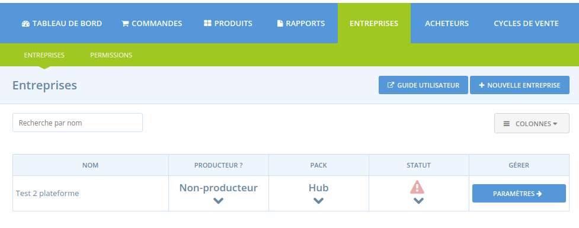
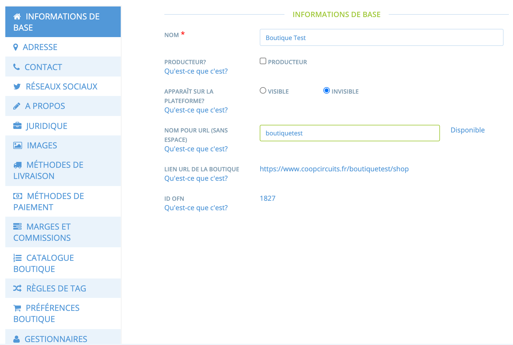
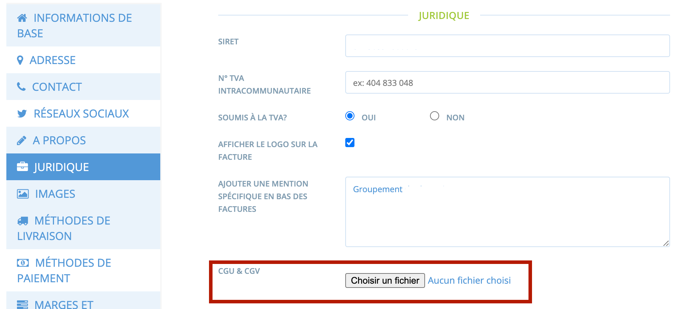
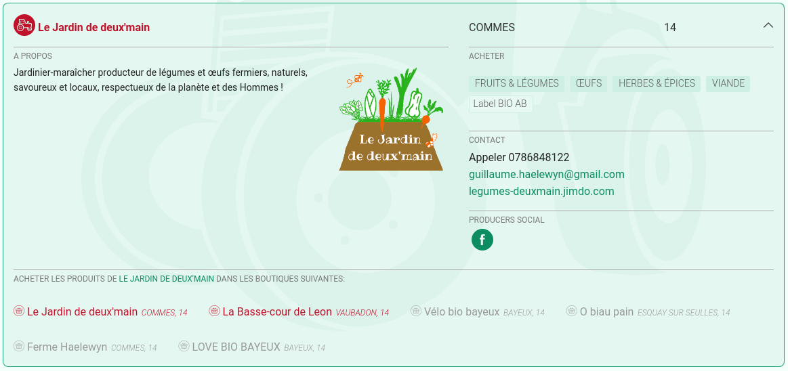

# Paramètres du profil

## Accéder aux paramètres

1. Une fois connecté, et après avoir rejoint l'espace d'administration, cliquez sur "Entreprises"
2. Cliquez ensuite sur le bouton bleu "Paramètres"


Attention : pour sauvegarder un changement de type de profils, n'oubliez pas de cliquer sur "enregistrer" en bas de la fenêtre à droite.


Vous accédez ensuite à différents menus de paramétrage de votre entreprise, qui ressemblent à ça \(comme rappelé précédemment, les menus proposés vont dépendre du type de profil choisi pour l'entreprise\) : 


Attention : pour sauvegarder vos modifications, n'oubliez pas de cliquer sur "mettre à jour" en bas de page. Il est recommandé de sauvegarder chaque page avant de changer de page.


## Détails des paramètres

### Informations de base

**Nom :** Il s'agit du nom de votre entreprise. Ce sera le titre de votre profil \(et de votre boutique le cas échéant\).

**Producteur ? :** Cochez cette case uniquement si vous êtes un producteur.


_Seuls les producteurs peuvent ajouter des produits sur la plateforme. Les hubs doivent sélectionner cette option lorsqu'ils vendent des paniers avec des produits de différents fournisseurs pour pouvoir créer les paniers comme des produits qu'ils "assemblent / fournissent" eux-mêmes._


**Apparaît sur la plateforme ?** **:** Si votre profil est prêt, cochez "visible" et il sera visible sur la plateforme ainsi que sur la carte. Vous pouvez le laisser invisible tant que vous modifiez encore ses paramètres \(contenu, images...\).

**Nom pour URL** **:** Vous pouvez personnaliser l'adresse web \(l'URL\) menant jusqu'à votre profil. Attention à ne pas renseigner d'espaces.

**Lien URL de la boutique :** Il s'agit du lien vers votre boutique \(si vous avez choisi d'en avoir une\). Ce lien est personnalisable comme vu au paragraphe précédent.

**ID OFN :** Cet identifiant permet de reconnaître sans aucune ambiguïté votre entreprise même si vous décidez de changer son nom par exemple, et simplifie le travail de l'équipe de support en cas de besoin.

### Adresse

L'adresse nous permet de géolocaliser votre entreprise sur une carte. Si vous disposez d'un profil simple, votre adresse complète ne s'affichera pas. En revanche, si vous disposez d'une boutique, votre adresse sera visible dans le menu "contact" de la boutique.

### Contact

**Nom :** Ce nom ne s'affichera pas sur votre profil, mais dans les emails de confirmation de commande, uniquement si vous disposez d'une boutique et vendez via la plateforme donc.

**Email public, téléphone et site internet :** Ces informations seront visibles sur votre profil afin que les internautes puissent vous contacter.

### Réseaux sociaux

**Facebook, Instagram, LinkedIn, Twitter :** Ce menu vous permet d'ajouter à votre profil les liens vers vos pages sur ces réseaux sociaux.

### A propos

**Description \(en bref\) :** Une ou deux phrases présentant votre entreprise, ce que vous faites. Cette description s'affichera sur votre profil lorsqu'il est affiché via une petite vignette.

**A propos :** Ici vous avez la place pour une description plus longue \(une page environ\). Elle s'affichera lors d'une présentation complète de votre profil.

### Juridique

**Siret** **:** Cette information ne sera pas publique. Elle est importante pour les détenteurs d'une boutique, lorsqu'ils veulent émettre des factures depuis la plateforme.

**N° de TVA intracommunautaire :** Cette information ne sera pas publique.

**Soumis à la TVA ?** – Si vous êtes soumis à la TVA, sélectionnez "oui".

**Afficher le logo sur la facture :** Vous pouvez choisir d'afficher ou pas le logo de votre entreprise sur les factures émises depuis la plateforme.

**Ajouter une mention spécifique en bas des factures :** Vous pouvez ajouter une mention spécifique que vous auriez l'obligation ou le souhait d'ajouter sur vos factures.

**CGU & CGV** : Indiquez vos propres CGV, associées à votre boutique, en téléchargeant un fichier .pdf ici.

Une fois le document sauvegardé. Il s'affichera pour l'acheteur au moment de la commande :   

Une fois acceptées par l'acheteur, les CGU/CGV ne seront plus affichées tant que vous ne mettez pas le document à jour.

### Images

**Logo :** Le logo sera visible lorsque votre profil est affiché en mode réduit, mais également en version complète. L'image d'origine doit être carrée \(100 x 100 par exemple\), sinon elle peut se faire couper lors du téléchargement.

**Promo image :** Votre bannière doit mesurer 1200 x 260, toute image non conforme sera rognée.  
 La bannière est affichée en haut de la page de votre entreprise et dans sa version condensée \(pop-up\).

Un exemple de profil en version condensée \(depuis la page "producteurs"\) :

Et en version complète \(depuis la carte, ou les pages boutiques\):

### Propriétés / Labels 


Visible seulement par les profils producteurs


Vous pouvez ajouter les labels ou "mentions/propriétés" qui vous correspondent \(Bio, Label Rouge...\) à cet endroit. Ils seront affichés par la suite sur **tous vos produits**. Vous pouvez aussi les renseigner au niveau du produit lui même si ces labels ou propriétés ne s'appliquent qu'à **certains produits**.

### Méthodes de livraison, de paiement et marges/commissions 


Non visible par les profils simples


Les [Méthodes de livraison](../mise-en-place-dune-boutique/types-de-livraisons.md), [les méthodes de paiement](https://github.com/ofnuserguidefr/guide-utilisateur-open-food-france/tree/f72c4e0a78bb6dc0c5b39249e706b0dbac84df5f/payment-methods-2.md) ainsi que [les marges et commissions](../mise-en-place-dune-boutique/frais-et-taxes.md) sont détaillées dans chacun de ces liens respectifs. 


Au moins une méthode de paiement et de livraison doit impérativement être renseignée pour pouvoir utiliser la fonctionnalité de boutique et vendre en ligne.


### Catalogue boutique

_\* non visible pour les profils simples_

Veuillez vous rendre sur la page [catalogue boutique](../produits-1/inventory-tool.md) avant de modifier les paramètres ici.

### Règles de tag


Non visibles par les profils simples


Ici sont gérés les tags que vous attribuez à vos clients, et qui vous permettent de grouper ces derniers par catégorie d'acheteurs pour leur offrir des accès, tarifs ou conditions spécifiques.

 Pour plus d'information rendez-vous sur la page [gestion des tags et comptes clients](../mise-en-place-dune-boutique/affichages-et-prix-differencies-par-categorie-dacheteur/customized-shopping-experience.md).

### Préférences boutique


Non visibles par les profils simples


**Message d'accueil boutique ouverte** : Ce message est facultatif. Il sera affiché sur votre boutique juste au-dessus des produits \(cf. exemple ci-dessous\). 

C'est l'endroit idéal pour communiquer des informations importantes comme des commandes spéciales, des informations sur vos cycles de vente, des actualités ou encore rappeler un mode opératoire !

**Message d'accueil boutique fermée** : Ce message s'affiche lorsque votre boutique est fermée. L'occasion d'indiquer la façon dont votre boutique est organisée ainsi que la prochaine date de la réouverture !

**Ordre d'affichage des catégories :** Par défaut, les produits sont rangés par ordre alphabétique dans votre boutique. Vous pouvez choisir d'afficher les produits par ordre de catégorie selon votre souhait. Le cas échéant, les produits seront affichés par ordre de catégorie puis par ordre alphabétique au sein de leur catégorie. 

**Trier les cycles de vente par** : Si votre boutique aura [plus d'un cycle de vente ouvert en même temps](../mise-en-place-dune-boutique/cycles-de-vente/opening-more-than-one-order-cycle.md) vous pouvez choisir l'ordre d'apparition des cycles dans le champ de sélection du cycle de vente à afficher : soit par date de fermeture, soit par date d'ouverture.

**Boutique visible par tous** **?** : Si vous sélectionnez "visible par tous", n'importe quel internaute pourra accéder votre boutique. Si vous sélectionnez "visible uniquement par les acheteurs logués", seuls les utilisateurs que vous aurez préalablement ajoutés à votre liste d'acheteurs pourront accéder à votre boutique, et devront pour cela se connecter. [En savoir plus sur la fonctionnalité boutique privée.](../mise-en-place-dune-boutique/private-shopfront.md)

**Commandes des invités** : Si vous sélectionnez "autoriser les commandes en mode invité" les visiteurs pourront commander vos produits sans être connectés à la plateforme donc sans avoir de compte utilisateur. Si vous souhaitez "forcer" la création de compte par vos acheteurs et qu'ils doivent se connecter pour pouvoir acheter, sélectionnez "demander que l'acheteur se connecte pour pouvoir commander". L'intérêt est que vous avez une garantie à minima que votre acheteur a certifié son email donc utilise un email actif. Cela peut contribuer à limiter le nombre de commandes finalement jamais récupérées, l'acheteur ne pouvant pas être complètement anonyme.

**Abonnements** : Vous pouvez permettre à vos acheteurs d’accéder à une [commande récurrente](https://ofn-user-guide.gitbook.io/guide-utilisateur-open-food-network/fonctionnalites-standards/subscriptions/creation-et-gestion-dune-commande-recurrente)

**Affichage du nom des acheteurs :** Vous pouvez afficher ou non le nom de vos acheteurs depuis la vue producteur


Ce menu n'est pas accessible si vous avez mis en place une boutique privée \(paragraphe précédent\)


### Gestionnaires

**Gestionnaire principal :** L'email de l'utilisateur principal en charge de gérer l'activité de l'entreprise sur la plateforme chez vous. Seul le gestionnaire principal peut désigner un autre gestionnaire principal, parmi les gestionnaires actuels.

**Notifications :** L'email de l'utilisateur vers qui toutes les correspondances seront redirigées \(confirmation de commandes,...\). Seul le gestionnaire principal peut désigner l'utilisateur recevant les notifications, parmi les gestionnaires actuels.

**Gestionnaires :** Ajoutez d'autres utilisateurs en tant que gestionnaires de l'entreprise. Il est nécessaire qu'ils aient tout d'abord créé un compte sur la plateforme. Si ce n'est pas le cas, vous devrez les inviter \(cf menu ci-dessous\).

**Inviter un gestionnaire :** Si vous voulez ajouter un gestionnaire mais que vous ne trouvez pas d'utilisateur correspondant à l'adresse email de la personne concernée, vous pouvez l'inviter comme gestionnaire. La personne recevra alors un email avec un lien de confirmation qui la renverra vers le choix d'un mot de passe et lui permettra de créer son compte. Dès le compte créé elle aura accès à la plateforme comme gestionnaire de l'entreprise concernée.

